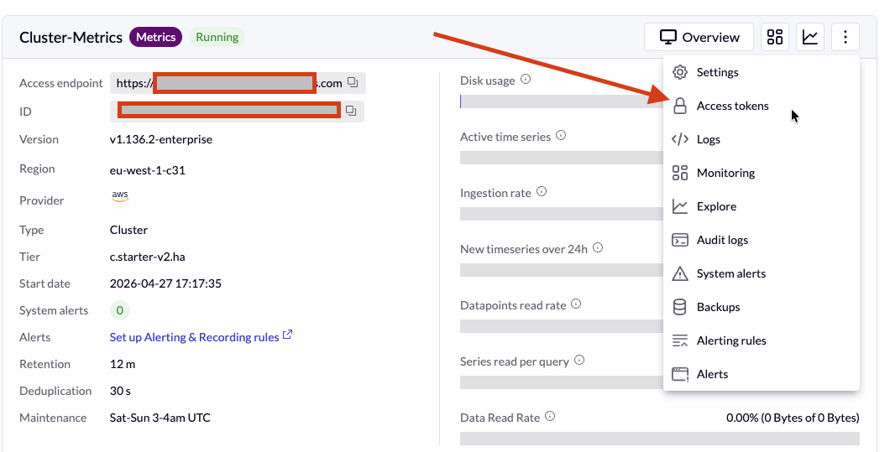
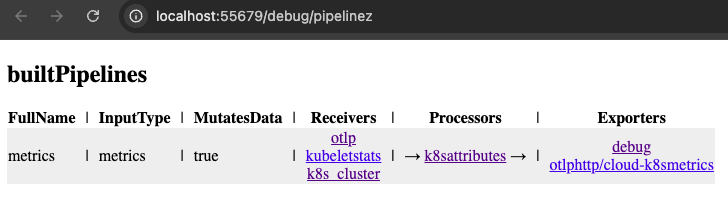
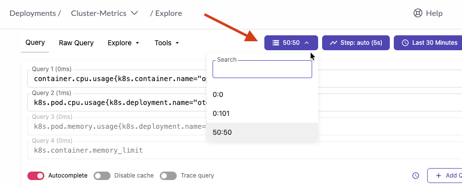

# Forwarding metrics to a remote backend

As mentioned previously, OpenTelemetry does not provide backends nor visualization tooling.
In this section, we will demonstrate how easy it is with OpenTelemetry to send metrics to a remote
storage.

## VictoriaMetrics Cloud setup

In this example, we will be sending the telemetry to VictoriaMetrics Cloud, but any remote
backend should work very similarly. For that, we need to log in into our organization. We created
one for this workshop: `CND-Romania` with a running VictoriaMetrics cluster.

First, you will be invited an organization. Upon invitation, you will receive an email like this:


After accepting the invitation and setting a password, you'll be all set to start sending data!
In order to do that, we need a URL and a token. Navigate to the deployment `Access Tokens` page,
by clicking on the 3 dots of your deployment:



Copy and note down (see next image):
1. the token assigned to your tenant
2. the endpoint of our VictoriaMetrics Cluster instance


> Now we have all set up to start sending metrics

## Configuring the OTel collector to forward metrics

We will now update our collector to send metrics to our deployment.
We need to add our `endpoint` and `token` into the new yaml with modifications
file [step-2.yaml](../helm/values/step-2.yaml), in the fields `token` and `endpoint`.

```yaml
opentelemetry-collector:
  alternateConfig:
    extensions:
      bearertokenauth/cloud-tenant:
        scheme: "Bearer"
        token: #ADD TOKEN HERE

    exporters:
      otlphttp/cloud-metrics:
        compression: gzip
        encoding: proto
        endpoint: #ADD URL HERE https://XXXXX.cloud.victoriametrics.com/opentelemetry
        auth:
          authenticator: bearertokenauth/cloud-tenant

    service:
      extensions: [health_check, zpages, bearertokenauth/cloud-tenant]
      pipelines:
        metrics:
          receivers: [otlp]
          processors: []
          exporters: [debug, otlphttp/cloud-metrics]
```

In this case, we are:
1. Adding the `bearertokenauth` extension and giving it a name: `cloud-tenant`
2. Adding an OTLP `exporter`, and attaching this `extension`
3. Adding both components to the `pipeline`

Once this is configured, we just need to upgrade our deployment by:

```sh
helm upgrade ws helm/cnd-demo -f helm/values/step-1.yaml -f helm/values/step-2.yaml -n cnd-ws
```
> NOTE: We could be using `--reuse-values` instead of using both value files. But in this
> way we ensure that steps are reproducible.

We can also test if the changes were applied by inspecting the **`PipelineZ`** page:
http://localhost:55679/debug/pipelinez

As you can see, all receivers and exporters are stacked together, and run in order:



## Exploring our metrics

The VictoriaMetrics UI (or `vmui`) is installed with VictoriaMetrics (you can check a playground
[here](https://play.victoriametrics.com/)). In the Cloud version, `vmui` is available via
[`Explore`](https://docs.victoriametrics.com/victoriametrics-cloud/exploring-data/exploring-victoriametrics/),
and accessible in https://console.victoriametrics.cloud/explore/.

Since we are using tenants, we need to _tell_ the tool to use our tenant. Tenant selection is
available as shown in the picture:



> **EXERCISE**: First, let's explore cardinality of our metrics and identify:
> * Metrics formatting and how they are different from prometheus
> * Cardinality: the number of series per metric
> * Request count and age

## Our first queries

If you're curious about which metrics are included by our collector, let's inspect the
[kubeletstatsreceiver documentation](https://github.com/open-telemetry/opentelemetry-collector-contrib/blob/main/receiver/kubeletstatsreceiver/documentation.md)

We can check CPU and Memory usage of our OpenTelemetry Collector Pod in different ways.
For example:

| Metric | Units | Description |
|--------|-------|-------------|
| `k8s.pod.cpu.usage` | CPUs | Total CPU usage (sum of all cores per second) averaged over the sample window
| `k8s.pod.memory.usage` | By | Pod memory usage |
| `k8s.container.memory.available` | By | Pod memory available |

If we navigate to the `Query` tool, we can check the cpu usage of our OpenTelemetry Collector Pod
by running:
```sh
k8s.pod.cpu.usage{k8s.deployment.name="otelcol"}
```
If we want to check Memory usage (in Mb) we should run:

```sh
k8s.pod.memory.usage{k8s.deployment.name="otelcol"} * 1.0e-6
```

> **EXERCISE**: Our OpenTelemetry Collector doesn't have limits set, so we cannot compare it
> against the `available memory`. Let's try to find if we have other pods with limits. In my case,
> the `coredns` pod has them. Do you have any?

I can check my memory usage percentage by:
```sh
 k8s.pod.memory.usage{k8s.deployment.name="coredns"} / sum(k8s.container.memory_limit{k8s.deployment.name="coredns"}) * 100
 ```

> **EXERCISE**: Feel free to use the `Autocomplete` functionality or navigate back to the `Cardinality explorer`
> to discover more metrics available!
