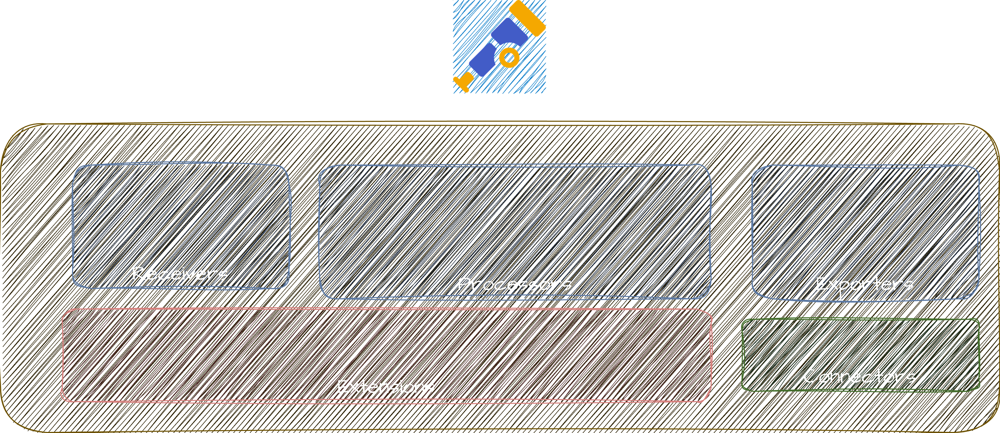
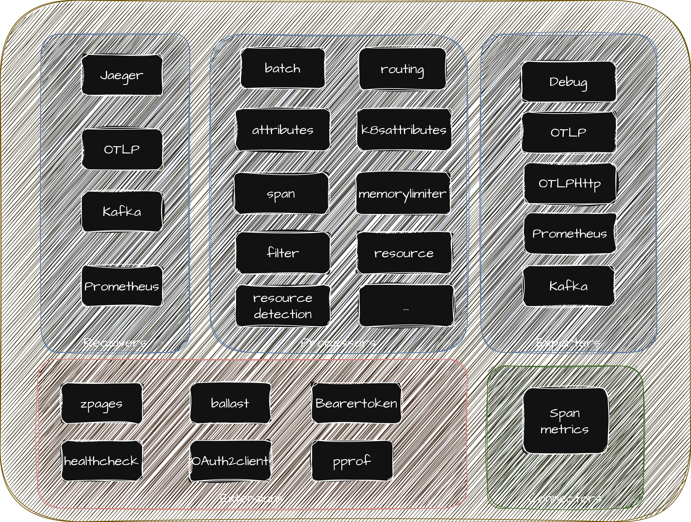
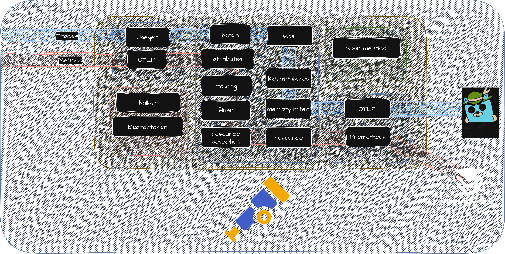

# OpenTelemetry intro
[OpenTelemetry](https://opentelemetry.io/) is a collection of **APIs**, **SDKs**, and **tools**. Use it to
instrument, generate, collect, and export telemetry data (metrics, logs, and traces) to help you
analyze your software’s performance and behavior.

> **NOTE**: OpenTelemetry is NOT (and does not provide):
> * A visualization tool
> * Ways of storing signals (databases)

## Main concepts
* Auto-instrumentation
* Collector
* Standard/Specification
* Libraries for all languages

# OpenTelemetry collector intro
One of this tools is the [OpenTelemetry collector](https://opentelemetry.io/docs/collector/), which
provides a vendor-agnostic implementation that:
* allows to receive, process and export telemetry data
* removes the need to run, operate, and maintain multiple agents/collectors
* allows sending data to one or more open source or commercial backends.

# Install the OpenTelemetry collector

## Clone the repo
If you're here, you may already have it, but this repo si available here:

```sh
git clone git@github.com:jgomezselles/cnd-workshop-2026.git
```

## Adding helm repos

Throughout this demo we will be using some helm charts as dependencies. For them to work, we need
to add them by:

```sh
helm repo add hermes https://jgomezselles.github.io/hermes-charts  ## Load generator, instrumented with OTel
helm repo add otelcol https://open-telemetry.github.io/opentelemetry-helm-charts ## To collect, transform and send telemetry
helm repo add vm https://victoriametrics.github.io/helm-charts  ## To store and visualize telemetry
helm repo add jaeger https://jaegertracing.github.io/helm-charts    ## To store and visualize traces
helm repo add grafana https://grafana.github.io/helm-charts    ## To visualize telemetry
```

## Update dependencies
Now we need to download these dependencies by running:
```sh
helm dep update helm/cnd-demo
```

## The OTel collector values

You can inspect the full default configuration of the OTel collector helm chart by running:

```sh
helm show values otelcol/opentelemetry-collector > otelcol-default.yaml
```



This dumps all available options with their defaults. The key sections to understand are:

* **`receivers`**: define how telemetry data enters the collector (e.g., OTLP over gRPC on port 4317 or HTTP on port 4318)
* **`processors`**: transform, filter, or batch data in-flight (e.g., `memory_limiter`, `batch`, `k8sattributes`)
* **`exporters`**: define where processed data is sent (e.g., `debug` to stdout, `otlphttp` to a backend)
* **`connectors`**: bridge two pipelines together; for example, `spanmetrics` derives RED metrics directly from traces
* **`service.pipelines`**: wire the above components into named signal pipelines (metrics, traces, logs), each with its own chain of receivers → processors → exporters

Each of these big groups contain many configurable components:



And pipelines allow us to define the path in which these components are put together:



## Presets

[Presets](https://opentelemetry.io/docs/platforms/kubernetes/helm/collector/#presets) are pre-packaged
configurations built into the OTel collector helm chart that handle the complex setup of common
components for you. They are a good starting point. If you need further customization, you can
always override them with manual configuration.

We will enable three presets in our first step:

* **`clusterMetrics`**: adds the `k8sclusterreceiver` to the metrics pipeline. It collects
  cluster-level metrics directly from the Kubernetes API server (similar to what Kube State Metrics
  provides).

* **`kubeletMetrics`**: adds the `kubeletstatsreceiver` to the metrics pipeline. It pulls node, pod,
container, and volume metrics from the API server on a kubelet and sends it down the metric pipeline
for further processing. It will help us to understand **resource usage**.

* **`kubernetesAttributes`**: adds the `k8sattributesprocessor` to every enabled pipeline. It
  enriches all telemetry (metrics, traces, and logs) with Kubernetes metadata such as pod names,
  namespace names, and node identifiers. It requires RBAC permissions (the chart handles this
  automatically) and is highly recommended for any Kubernetes deployment.

> If using `mode: deployment`, it's recommended to only run a single replica, since multiple
> instances would produce duplicate data. In general, a `DaemonSet` is recommended. In this example,
> we will use deployment for simplicity.

## Our Collector config

Our first configuration will be minimal. You can check it in the [step-1.yaml](../helm/values/step-1.yaml)
file, but it's enough to say that we will use those presets and the `contrib` image.

> **Why the contrib image?**
> The standard `otel/opentelemetry-collector` ships only the core built-in components. We will use the
> [`otel/opentelemetry-collector-contrib`](https://github.com/open-telemetry/opentelemetry-collector-contrib)
> image, which bundles all community-contributed components. This is required for Kubernetes-specific
> receivers and processors like `k8sclusterreceiver`, `kubeletMetrics` and `k8sattributesprocessor`, as well
> as exporters for backends like VictoriaMetrics.

## Installing the collector

First, we will create a namespace:
```sh
kubectl create ns cnd-ws
```

After that, we will install the collector with step-1.yaml like:

```sh
helm install ws helm/cnd-demo -f helm/values/step-1.yaml -n cnd-ws
```

## First approach debugging the collector

We will use the [zpages extension](https://github.com/open-telemetry/opentelemetry-collector/blob/main/extension/zpagesextension/README.md).
After performing a port forwarding like:

```sh
kubectl port-forward -n cnd-ws deployments/otelcol 55679:55679
```
We can observe (taken from the docs):

| zPages route | Description | URL  |
|--------------|-------------|------|
| **ServiceZ** | Overview of the collector services and quick access to the pipelinez, extensionz, and featurez zPages.|  http://localhost:55679/debug/servicez |
| **PipelineZ** | Running pipelines in the collector | http://localhost:55679/debug/pipelinez |
| **ExtensionZ**| Shows the extensions that are active in the collector.|  http://localhost:55679/debug/extensionz |
| **FeatureZ** | Lists the feature gates available along with their current status and description. | http://localhost:55679/debug/featurez |
| **TraceZ**| Available to examine and bucketize spans by latency buckets | http://localhost:55679/debug/tracez |
| **ExpvarZ** | Useful information about Go runtime | http://localhost:55679/debug/expvarz |

## EXERCISE: Now, how did these presets affect the collector's config?

<details>
<summary>Hint/Answer</summary>

By inspecting the [PipelineZ](http://localhost:55679/debug/pipelinez), we can see that our
metrics pipeline has been automatically modified.

</details>

# Continue this workshop
Part 1 is over! Go back to [Index](../README.md#part-i)