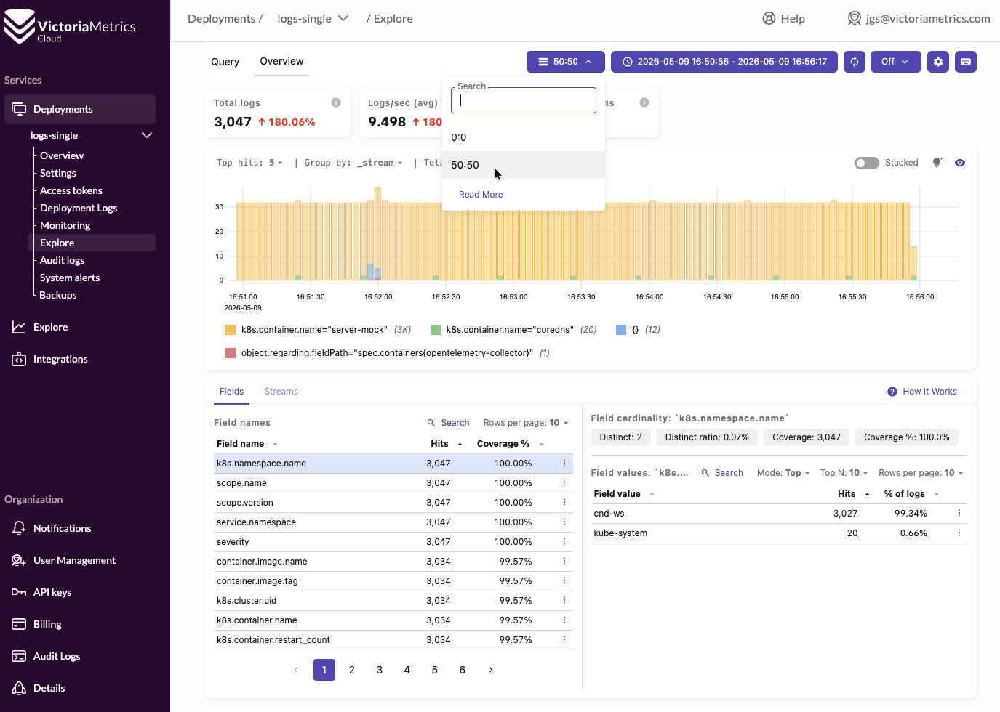

# Collecting logs

Metrics are cool and nice, but at the end of the day we all end up watching logs.
However, things get messy at scale, and it's better to have easy ways to collect and filter them.

In the next part of this workshop we are going to:
* Collecting k8s logs
* Read logs from our application stdout
* Group logs by containers
* Define our tenant directly in the collector, instead of by Access Tokens
- Observe our logs in VLUI

> Now we will explain the configuration to apply.
> We will do it later together!

## Collecting k8s logs and reading logs from our application stdout

First, we are going to enable the following presets:
```yaml
  presets:
    kubernetesEvents: # enables the k8sobjectreceiver
      enabled: true
    logsCollection: # enables the filelogreceiver
      enabled: true
```

* **[`k8sobjectreceiver`](https://opentelemetry.io/docs/platforms/kubernetes/collector/components/#kubernetes-objects-receiver)**:
The Kubernetes Object receiver collects, either by pulling or watching, objects from the
Kubernetes API server. The most common use case for this receiver is **watching Kubernetes
events**, but it can be used to collect any type of Kubernetes object.
* **[`filelogreceiver`](https://opentelemetry.io/docs/platforms/kubernetes/collector/components/#filelog-receiver)**:
tails and parses logs from files. The de facto solution for collecting any logs from
Kubernetes.

## Preparing our logs

We are also changing the OTel collector configuration with a new exporter. In this exporter, apart
from applying the Access Token (as we did before), we will define the tenants via headers.

After inspection, I found that the message field is written inside the attribute: `object.note`.
We are telling that to VictoriaLogs by specifying it in the `VL-Msg-Field` as a header too.

The last change we'll do is to define [streams](https://docs.victoriametrics.com/victorialogs/keyconcepts/#stream-fields).
As we will see, since we're observing logs at scale it will be very convenient to group them in
different ways. In our case, we will make use of the `k8s.container.name` attribute, to group logs
by container. (I also found interesting `object.regarding.fieldPath` to explore ib¡n this example).

```yaml
    exporters:
      otlphttp/cloud-logs:
        compression: gzip
        encoding: proto
        logs_endpoint: #ADD URL HERE https://XXXXX.cloud.victoriametrics.com/insert/opentelemetry/v1/logs
        headers:
          VL-Msg-Field: object.note
          VL-Stream-Fields: object.regarding.fieldPath,k8s.container.name
          AccountID: "" #ADD Tenant AccountID here
          ProjectID: "" #ADD Project AccountID here
        auth:
          authenticator: bearertokenauth/cloud-logs
```

## Exporting logs to our remote instance

Let's now go and enable everything:
* Go to your **VictoriaLogs** deployment `Access Tokens` section and pick one. (We're not using Tokens per tenant here!)
* Inside the [step-4.yaml](../helm/values/step-4.yaml) file, we need to make 3 changes:
  1. Add your token into the new `bearertokenauth/cloud-logs` extension
  2. Inside the `otlphttp/cloud-logs`, fill the `logs_endpoint`: with your url with this address: `https://XXXXX.cloud.victoriametrics.com/insert/opentelemetry/v1/logs`
  3. Set your `AccountID` and `ProjectID` with your tenant (i.e. if your tenant is `10:1`, you'll need to add `AccountID: "10"` and `ProjectID: "1"` )

After performing these changes, we're ready to start collecting and sending our logs by:

```sh
helm upgrade ws helm/cnd-demo -f helm/values/step-1.yaml -f helm/values/step-2.yaml -f helm/values/step-3.yaml -f helm/values/step-4.yaml  -n cnd-ws
```

> **EXERCISE**: Now, if we execute the port-forward again, we can access the [PipelineZ](http://localhost:55679/debug/pipelinez)
> tool and see what happened to our collector.

# Logs Overview
Now, we can inspect the data we're sending. Inside the **VictoriaLogs instance**'s `Explore` section:
1. Click on `Overview`
2. Select your `tenant`

Here you can see all the relevant data for your logs.



> **EXERCISE**: Which container is producing most of the logs?

> **EXERCISE**: Explore a log from the `server-mock` container and get an overview of all the fields.

# Querying logs
Finally, let's try to filter logs manually:
1. Click on `Query`
2. Select your `tenant`

In the `Log query` box, we can fetch data by using the [LogsQL](https://docs.victoriametrics.com/victorialogs/logsql/)
language. For example:

* `_time:5m`: will return logs in the last 5 minutes
* `_time:5m PUT`: will return logs containing the PUT word in the last 5 minutes
* `_time:5m PUT | sort by (_time) asc`: will sort those results in reverse order (from oldest to newest)

We can also use the [`stats pipe`](https://docs.victoriametrics.com/victorialogs/logsql/#stats-pipe)
to perform operations.

> **EXERCISE**: Knowing that the `count()`stats operations exists. Could you tell how many PUT operations
> occurred during the last 10 seconds?

# Continue this workshop
Part 4 is over! Go back to [Index](../README.md#part-i)
