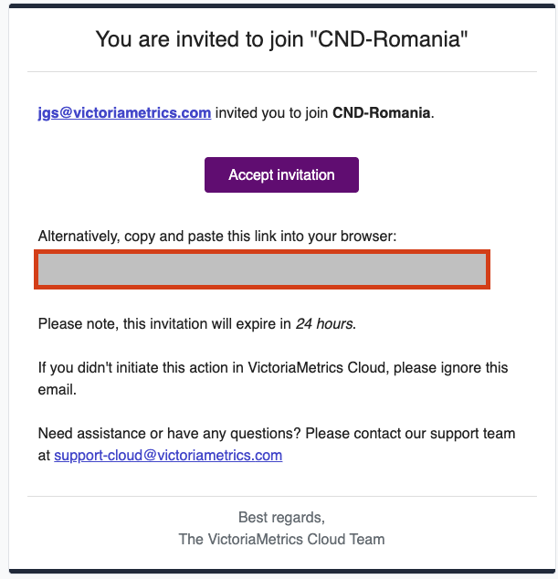
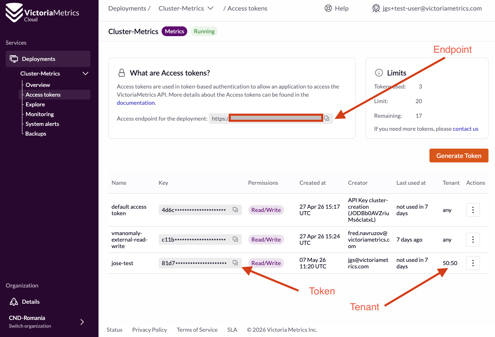
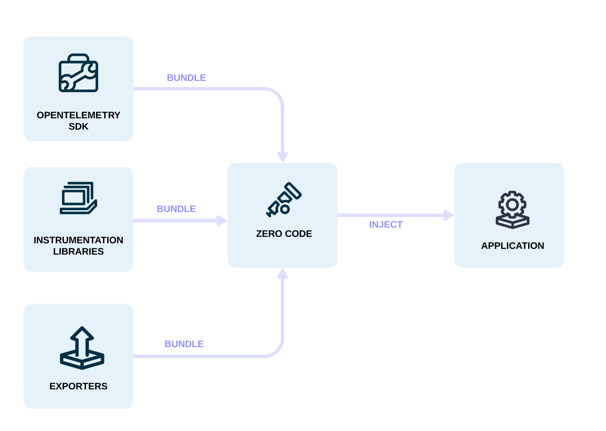
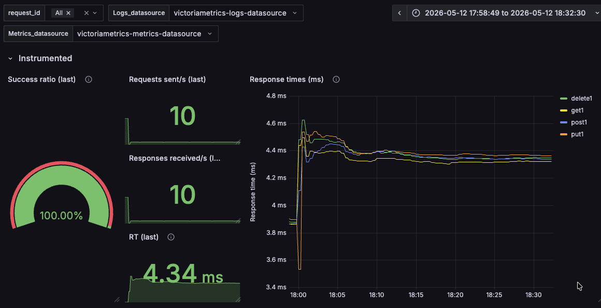
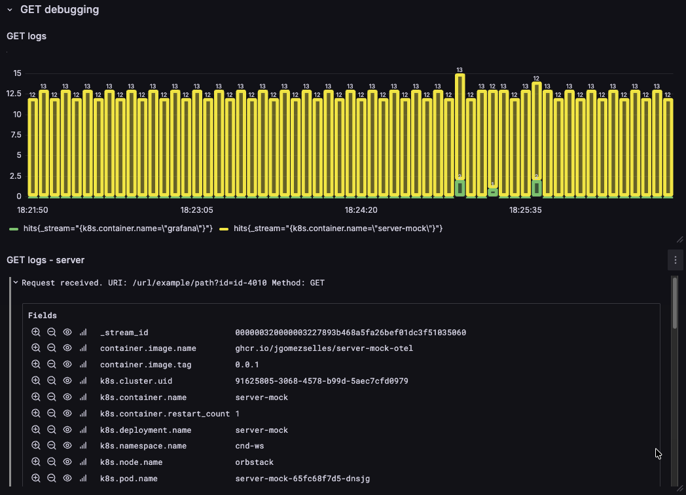

# cnd-workshop-2026
Repo with guide and assets to follow the 2026 CND Romania workshop: Observability unlocked with
OpenTelemetry and the VictoriaMetrics Stack

# Abstract

Observability doesn’t have to be hard. In this hands-on workshop, we’ll show how to go from zero to
Kubernetes observability in minutes with Open Source projects like VictoriaMetrics, AlertManager,
OpenTelemetry or Grafana.

This will be done with practical, live examples. We’ll learn how to generate, process and export
metrics and logs by:
* Deploying a demo app, collecting data with OpenTelemetry collectors and
exporting them with proper authentication
* Exploring metrics cardinality and integrating dashboards with Grafana
* Learn metrics and logs dynamics over time to improve quality and maintenance of our observability
setup with anomaly detection mechanisms
* Create alerts and get notified before problems escalate
* We’ll give a preview of distributed tracing with VictoriaTraces
* We’ll also cover log visualization and aggregation, together with metrics generation from other
signals

By the end, you’ll have the knowledge to build a production-grade observability stack from scratch - fast, reliable, and scalable.

# Links
* Workshop link: https://cloudnativedays.ro/workshops/a130c5e1-fe82-4b06-93c9-c5f65a3e6d9d
* Repo link: https://github.com/jgomezselles/cnd-workshop-2026

# TODOs
- [ ] Presentation
- [X] Create repo
- [X] Create workshop organization
  - [X] Provide credits for the cluster
  - [ ] Run cluster 2 days before the WS
  - [ ] Invite users into the org
  - [ ] Assign tenants


# Requirements

## Tooling
* Docker (tested on versions:  Client - 28.2.2 , Server 29.4.0)
* Docker compose (tested on version v2.13.0)
* POSIX shell for helper scripts: Linux/macOS Terminal or WSL 2 on Windows
* Small k8s distro: minikube, kind or similar
* kubectl: (tested on version: v1.33.1)
* Helm: (tested on version: v3.18.1)

# Part I

## OpenTelemetry intro
[OpenTelemetry](https://opentelemetry.io/) is a collection of **APIs**, **SDKs**, and **tools**. Use it to
instrument, generate, collect, and export telemetry data (metrics, logs, and traces) to help you
analyze your software’s performance and behavior.

> **NOTE**: OpenTelemetry is NOT (and does not provide):
> * A visualization tool
> * Ways of storing signals (databases)

### Main concepts
* Auto-instrumentation
* Collector
* Standard/Specification
* Libraries for all languages

## OpenTelemetry collector intro
One of this tools is the [OpenTelemetry collector](https://opentelemetry.io/docs/collector/), which
provides a vendor-agnostic implementation that:
* allows to receive, process and export telemetry data
* removes the need to run, operate, and maintain multiple agents/collectors
* allows sending data to one or more open source or commercial backends.

## Install OpenTelemetry collector

### Clone the repo
If you're here, you may already have it, but this repo si available here:

```sh
git clone git@github.com:jgomezselles/cnd-workshop-2026.git
```

### Adding helm repos

Throughout this demo we will be using some helm charts as dependencies. For them to work, we need
to add them by:

```sh
helm repo add hermes https://jgomezselles.github.io/hermes-charts  ## Load generator, instrumented with OTel
helm repo add otelcol https://open-telemetry.github.io/opentelemetry-helm-charts ## To collect, transform and send telemetry
helm repo add vm https://victoriametrics.github.io/helm-charts  ## To store and visualize telemetry
helm repo add jaeger https://jaegertracing.github.io/helm-charts    ## To store and visualize traces
helm repo add grafana https://grafana.github.io/helm-charts    ## To visualize telemetry
```

### Update dependencies
Now we need to download these dependencies by running:
```sh
helm dep update helm/cnd-demo
```

### The OTel collector values

You can inspect the full default configuration of the OTel collector helm chart by running:

```sh
helm show values otelcol/opentelemetry-collector > otelcol-default.yaml
```

This dumps all available options with their defaults. The key sections to understand are:

* **`receivers`**: define how telemetry data enters the collector (e.g., OTLP over gRPC on port 4317 or HTTP on port 4318)
* **`processors`**: transform, filter, or batch data in-flight (e.g., `memory_limiter`, `batch`, `k8sattributes`)
* **`exporters`**: define where processed data is sent (e.g., `debug` to stdout, `otlphttp` to a backend)
* **`connectors`**: bridge two pipelines together; for example, `spanmetrics` derives RED metrics directly from traces
* **`service.pipelines`**: wire the above components into named signal pipelines (metrics, traces, logs), each with its own chain of receivers → processors → exporters

> **Why the contrib image?**
> The standard `otel/opentelemetry-collector` ships only the core built-in components. We will use the
> [`otel/opentelemetry-collector-contrib`](https://github.com/open-telemetry/opentelemetry-collector-contrib)
> image, which bundles all community-contributed components. This is required for Kubernetes-specific
> receivers and processors like `k8sclusterreceiver`, `kubeletMetrics` and `k8sattributesprocessor`, as well
> as exporters for backends like VictoriaMetrics.

### Presets

[Presets](https://opentelemetry.io/docs/platforms/kubernetes/helm/collector/#presets) are pre-packaged
configurations built into the OTel collector helm chart that handle the complex setup of common
components for you. They are a good starting point. If you need further customization, you can
always override them with manual configuration.

We will enable two presets in our first step:

* **`clusterMetrics`**: adds the `k8sclusterreceiver` to the metrics pipeline. It collects
  cluster-level metrics directly from the Kubernetes API server (similar to what Kube State Metrics
  provides).

* **`kubeletMetrics`**: adds the `kubeletstatsreceiver` to the metrics pipeline. It pulls node, pod,
container, and volume metrics from the API server on a kubelet and sends it down the metric pipeline
for further processing. It will help us to understand **resource usage**.

* **`kubernetesAttributes`**: adds the `k8sattributesprocessor` to every enabled pipeline. It
  enriches all telemetry (metrics, traces, and logs) with Kubernetes metadata such as pod names,
  namespace names, and node identifiers. It requires RBAC permissions (the chart handles this
  automatically) and is highly recommended for any Kubernetes deployment.

> If using `mode: deployment`, it's recommended and a single replica, since multiple
> instances would produce duplicate data. In general, a `DaemonSet` is recommended. In this example,
> we will use deployment for simplicity.

### Installing the collector
First, we will create a namespace:
```sh
kubectl create ns cnd-ws
```

After that, we will install the collector with step-1.yaml like:

```sh
helm install ws helm/cnd-demo -f helm/values/step-1.yaml -n cnd-ws
```

### First approach debugging the collector

We will use the [zpages extension](https://github.com/open-telemetry/opentelemetry-collector/blob/main/extension/zpagesextension/README.md).
After performing a port forwarding like:

```sh
kubectl port-forward -n cnd-ws deployments/otelcol 55679:55679
```
We can observe (taken from the docs):

| zPages route | Description | URL  |
|--------------|-------------|------|
| **ServiceZ** | Overview of the collector services and quick access to the pipelinez, extensionz, and featurez zPages.|  http://localhost:55679/debug/servicez |
| **PipelineZ** | Running pipelines in the collector | http://localhost:55679/debug/pipelinez |
| **ExtensionZ**| Shows the extensions that are active in the collector.|  http://localhost:55679/debug/extensionz |
| **FeatureZ** | Lists the feature gates available along with their current status and description. | http://localhost:55679/debug/featurez |
| **TraceZ**| Available to examine and bucketize spans by latency buckets | http://localhost:55679/debug/tracez |
| **ExpvarZ** | Useful information about Go runtime | http://localhost:55679/debug/expvarz |

> **EXERCISE**: Now, what did these presets we enabled actually do?
> By inspecting the [PipelineZ](http://localhost:55679/debug/pipelinez), we can see that our
> metrics pipeline has been automatically modified.

## Forwarding metrics to a remote backend

As mentioned previously, OpenTelemetry does not provide backends nor visualization tooling.
In this section, we will demonstrate how easy it is with OpenTelemetry to send metrics to a remote
storage.

### VictoriaMetrics Cloud setup

In this example, we will be sending the telemetry to VictoriaMetrics Cloud, but any remote
backend should work very similarly. For that, we need to log in into our organization. We created
one for this workshop: `CND-Romania` with a running VictoriaMetrics cluster.

First, you will be invited an organization. Upon invitation, you will receive an email like this:



After accepting the invitation and setting a password, you'll be all set to start sending data!
In order to do that, we need a URL and a token. Navigate to the deployment `Access Tokens` page,
by clicking on the 3 dots of your deployment:


Copy and note down (see next image):
1. the token assigned to your tenant
2. the endpoint of our VictoriaMetrics Cluster instance



> Now we have all set up to start sending metrics

### Configuring the OTel collector to forward metrics

We will now update our collector to send metrics to our deployment.
We need to add our `endpoint` and `token` into the new yaml with modifications
file [step-2.yaml](helm/values/step-2.yaml), in the fields `token` and `endpoint`.

```yaml
opentelemetry-collector:
  alternateConfig:
    extensions:
      bearertokenauth/cloud-tenant:
        scheme: "Bearer"
        token: #ADD TOKEN HERE

    exporters:
      otlphttp/cloud-metrics:
        compression: gzip
        encoding: proto
        endpoint: #ADD URL HERE https://XXXXX.cloud.victoriametrics.com/opentelemetry
        auth:
          authenticator: bearertokenauth/cloud-tenant

    service:
      extensions: [health_check, zpages, bearertokenauth/cloud-tenant]
      pipelines:
        metrics:
          receivers: [otlp]
          processors: []
          exporters: [debug, otlphttp/cloud-metrics]
```

In this case, we are:
1. Adding the `bearertokenauth` extension and giving it a name: `cloud-tenant`
2. Adding an OTLP `exporter`, and attaching this `extension`
3. Adding both components to the `pipeline`

Once this is configured, we just need to upgrade our deployment by:

```sh
helm upgrade ws helm/cnd-demo -f helm/values/step-1.yaml -f helm/values/step-2.yaml -n cnd-ws
```
> NOTE: We could be using `--reuse-values` instead of using both value files. But in this
> way we ensure that steps are reproducible.

We can also test if the changes were applied by inspecting the **`PipelineZ`** page:
http://localhost:55679/debug/pipelinez

As you can see, all receivers and exporters are stacked together, and run in order:


### Exploring our metrics

The VictoriaMetrics UI (or `vmui`) is installed with VictoriaMetrics (you can check a playground
[here](https://play.victoriametrics.com/)). In the Cloud version, `vmui` is available via
[`Explore`](https://docs.victoriametrics.com/victoriametrics-cloud/exploring-data/exploring-victoriametrics/),
and accessible in https://console.victoriametrics.cloud/explore/.

Since we are using tenants, we need to _tell_ the tool to use our tenant. Tenant selection is
available as shown in the picture:


> **EXERCISE**: First, let's explore cardinality of our metrics and identify:
> * Metrics formatting and how they are different from prometheus
> * Cardinality: the number of series per metric
> * Request count and age

### Our first queries

If you're curious about which metrics are included by our collector, let's inspect the
[kubeletstatsreceiver documentation](https://github.com/open-telemetry/opentelemetry-collector-contrib/blob/main/receiver/kubeletstatsreceiver/documentation.md)

We can check CPU and Memory usage of our OpenTelemetry Collector Pod in different ways.
For example:

| Metric | Units | Description |
|--------|-------|-------------|
| `k8s.pod.cpu.usage` | CPUs | Total CPU usage (sum of all cores per second) averaged over the sample window
| `k8s.pod.memory.usage` | By | Pod memory usage |
| `k8s.container.memory.available` | By | Pod memory available |

If we navigate to the `Query` tool, we can check the cpu usage of our OpenTelemetry Collector Pod
by running:
```sh
k8s.pod.cpu.usage{k8s.deployment.name="otelcol"}
```
If we want to check Memory usage (in Mb) we should run:

```sh
k8s.pod.memory.usage{k8s.deployment.name="otelcol"} * 1.0e-6
```

> **EXERCISE**: Our OpenTelemetry Collector doesn't have limits set, so we cannot compare it
> against the `available memory`. Let's try to find if we have other pods with limits. In my case,
> the `coredns` pod has them. Do you have any?

I can check my memory usage percentage by:
```sh
 k8s.pod.memory.usage{k8s.deployment.name="coredns"} / sum(k8s.container.memory_limit{k8s.deployment.name="coredns"}) * 100
 ```

> **EXERCISE**: Feel free to use the `Autocomplete` functionality or navigate back to the `Cardinality explorer`
> to discover more metrics available!

## Manual instrumentation

In this theoretical section, we will briefly explain OpenTelemetry Instrumentation.

### What is OpenTelemetry instrumentation?

[Instrumentation](https://opentelemetry.io/docs/concepts/instrumentation/) is the process of adding
observability to your application using the OpenTelemetry [APIs and SDKs](https://opentelemetry.io/docs/languages/).
The OTel SDK provides a vendor-neutral way to generate metrics, traces, and logs from your code, so
your application emits telemetry in a standard format regardless of the backend you send it to. This
is what allows you to swap or combine backends (VictoriaMetrics, Jaeger, etc.) without changing your
application code.

### What is Automatic instrumentation?

[Automatic instrumentation](https://opentelemetry.io/docs/concepts/instrumentation/automatic/) (also
called zero-code instrumentation) lets you add telemetry to an application without modifying its
source code. OTel provides auto-instrumentation support for many languages and it typically covers
popular frameworks and libraries out of the box (HTTP servers, database clients, messaging systems,
etc.). There are three main approaches:

* **eBPF-based**: Hooks into the Linux kernel using eBPF probes to observe system calls and network
  traffic at the OS level, with zero changes to the application process. Does not require access to
  the source code or the runtime, but is limited to what is visible at the kernel boundary.
* **Bytecode injection (agent-based)**: For languages with a managed runtime (JVM, .NET CLR), an
  agent is attached to the process at startup and patches bytecode on the fly to inject spans and
  metrics into supported libraries. Requires a compatible runtime but gives rich, framework-level
  coverage.
* **Library auto-instrumentation via environment variables**: For languages like Python, Node.js, or
  Go, the OTel SDK is loaded alongside the application (often triggered by environment variables
  like `OTEL_EXPORTER_OTLP_ENDPOINT`) and automatically wraps well-known libraries. The application
  does not need explicit instrumentation calls, but it does need to import the OTel packages.


*Source: [OpenTelemetry documentation](https://opentelemetry.io/docs/concepts/instrumentation/zero-code/),
licensed under [CC BY 4.0](https://creativecommons.org/licenses/by/4.0/).*

### True manual instrumentation (and why we need it for C++)

When none of the automatic approaches are available or sufficient, you need to use the
[OTel SDK for your language](https://opentelemetry.io/docs/languages/) directly: creating meters,
defining instruments (counters, histograms, gauges), and recording values explicitly in your code.

This is the case for our demo app, which is written in **C++**. C++ compiles to native machine code,
so there is no bytecode to inject and no managed runtime to hook into. eBPF can observe syscalls and
network events, but it cannot capture business-level metrics like request counts, latency
distributions, or custom application state. The [OpenTelemetry C++ SDK](https://opentelemetry.io/docs/languages/cpp/)
is therefore the only way to generate the application metrics we care about: we add instrumentation
calls directly in the source code to define and record the signals we want to observe.

## Deploy demo app

We will now enable a load generator [hermes](https://github.com/jgomezselles/hermes), which is
manually instrumented with OpenTelemetry. If you're curious about how, you can check the
[`olly`](https://github.com/jgomezselles/hermes/tree/main/src/o11y) folder  or how instruments
are created in the [`stats`](https://github.com/jgomezselles/hermes/blob/main/src/stats/stats.cpp) file.

In order to install it, we will apply now the following changes via the file [step-3.yaml](helm/values/step-3.yaml):

### Application

Important to note how we are routing telemetry to our OTel collector:

```yaml
hermes:
...
  script:
    cm: traffic-script-cm # traffic script with instructions
  o11y: # these are converted to env variables and captured by the app
    metrics_endpoint: http://otelcol:4318/v1/metrics
    traces_endpoint: http://otelcol:4318/v1/traces
```

### Server Mock

Written in go, it just logs and responds. Env variables are used:
```yaml
serverMock:
...
  env: # these are used by the go runtime
    - name: OTEL_EXPORTER_OTLP_PROTOCOL
      value: "http/protobuf"
    - name: OTEL_EXPORTER_OTLP_ENDPOINT
      value: "http://otelcol:4318"
```

### OTel collector

Our apps will be sending logs and traces too. Note that:

1. We don't need to create a new receiver. The same `otlpreceiver` is used for all signals.
2. These new pipelines will just log, via the `debugexporter` the new logs and traces.

```yaml
opentelemetry-collector:
  alternateConfig:
    service:
      pipelines: # We are adding 2 pipelines
        traces:
          receivers: [otlp]
          processors: []
          exporters: [debug]
        logs:
          receivers: [otlp]
          processors: []
          exporters: [debug]
```

Now we can go ahead and upgrade with these changes:

```sh
helm upgrade ws helm/cnd-demo -f helm/values/step-1.yaml -f helm/values/step-2.yaml -f helm/values/step-3.yaml -n cnd-ws
```

In order to check if changes were correctly applied, we can
run again the port-forward and see the **`PipelineZ`** utility to see the pipelines:
```sh
kubectl port-forward -n cnd-ws deployments/otelcol 55679:55679
```

> **EXERCISE**: Inspect the pipeline and OTel collector logs

## Running the app

Let's run traffic in the background in a new console by:
```sh
kubectl exec -n cnd-ws $(kubectl get pod -n cnd-ws -l app.kubernetes.io/name=hermes -o jsonpath='{.items[0].metadata.name}') -- hermes -r10 -p1 -t1000
```

This will send requests at a rate `r=10` rps for time `t=100`s (and print to console stderr every `p=1`s).

> **EXERCISE**: Let's use the `Autocomplete` functionality or navigate back to the `Cardinality explorer`
> to discover which new metrics we have, and how the kubelet is exposing more containers now.

## Collecting logs

Metrics are cool and nice, but at the end of the day we all end up watching logs.
However, things get messy at scale, and it's better to have easy ways to collect and filter them.

In the next part of this workshop we are going to:
* Collecting k8s logs
* Read logs from our application stdout
* Group logs by containers
* Define our tenant directly in the collector, instead of by Access Tokens
* Observe our logs in VLUI

> Now we will explain the configuration to apply. We will do it later together!

### Collecting k8s logs and reading logs from our application stdout

First, we are going to enable the following presets:
```yaml
  presets:
    kubernetesEvents: # enables the k8sobjectreceiver
      enabled: true
    logsCollection: # enables the filelogreceiver
      enabled: true
```

* **[`k8sobjectreceiver`](https://opentelemetry.io/docs/platforms/kubernetes/collector/components/#kubernetes-objects-receiver)**:
The Kubernetes Objects receiver collects, either by pulling or watching, objects from the
Kubernetes API server. The most common use case for this receiver is **watching Kubernetes
events**, but it can be used to collect any type of Kubernetes object.
* **[`filelogreceiver`](https://opentelemetry.io/docs/platforms/kubernetes/collector/components/#filelog-receiver)**:
tails and parses logs from files. The de facto solution for collecting any logs from
Kubernetes.

### Preparing our logs

We are also changing the OTel collector configuration with a new exporter. In this exporter, apart
from applying the Access Token (as we did before), we will define the tenants via headers.

After inspection, I found that the message field is written inside the attribute: `object.note`.
We are telling that to VictoriaLogs by specifying it in the `VL-Msg-Field` as a header too.

The last change we'll do is to define [streams](https://docs.victoriametrics.com/victorialogs/keyconcepts/#stream-fields).
As we will see, since we're observing logs at scale it will be very convenient to group them in
different ways. In our case, we will make use of the `k8s.container.name` attribute, to group logs
by container. (I also found interesting `object.regarding.fieldPath` to explore ib¡n this example).

```yaml
    exporters:
      otlphttp/cloud-logs:
        compression: gzip
        encoding: proto
        logs_endpoint: #ADD URL HERE https://XXXXX.cloud.victoriametrics.com/insert/opentelemetry/v1/logs
        headers:
          VL-Msg-Field: object.note
          VL-Stream-Fields: object.regarding.fieldPath,k8s.container.name
          AccountID: "" #ADD Tenant AccountID here
          ProjectID: "" #ADD Project AccountID here
        auth:
          authenticator: bearertokenauth/cloud-logs
```

### Exporting logs to our remote instance

Let's now go and enable everything:
1. Go to your **VictoriaLogs** deployment `Access Tokens` section and pick one. (We're not using Tokens per tenant here!)
2. Inside the [step-4.yaml](helm/values/step-4.yaml) file, we need to make 3 changes:
  1. Add your token into the new `bearertokenauth/cloud-logs` extension
  2. Inside the `otlphttp/cloud-logs`, fill the `logs_endpoint`: with your url with this address: `https://XXXXX.cloud.victoriametrics.com/insert/opentelemetry/v1/logs`
  3. Set your `AccountID` and `ProjectID` with your tenant (i.e. if your tenant is `10:1`, you'll need to add `AccountID: "10"` and `ProjectID: "1"` )

After performing these changes, we're ready to start collecting and sending our logs by:

```sh
helm upgrade ws helm/cnd-demo -f helm/values/step-1.yaml -f helm/values/step-2.yaml -f helm/values/step-3.yaml -f helm/values/step-4.yaml  -n cnd-ws
```

> **EXERCISE**: Now, if we execute the port-forward again, we can access the [PipelineZ](http://localhost:55679/debug/pipelinez)
> tool and see what happened to our collector.

## Logs Overview
Now, we can inspect the data we're sending. Inside the **VictoriaLogs instance**'s `Explore` section:
1. Click on `Overview`
2. Select your `tenant`

Here you can see all the relevant data for your logs.


> **EXERCISE**: Which container is producing most of the logs?

> **EXERCISE**: Explore a log from the `server-mock` container and get an overview of all the fields.

## Querying logs
Finally, let's try to filter logs manually:
1. Click on `Query`
2. Select your `tenant`

In the `Log query` box, we can fetch data by using the [LogsQL](https://docs.victoriametrics.com/victorialogs/logsql/)
language. For example:

* `_time:5m`: will return logs in the last 5 minutes
* `_time:5m PUT`: will return logs containing the PUT word in the last 5 minutes
* `_time:5m PUT | sort by (_time) asc`: will sort those results in reverse order (from oldest to newest)

We can also use the [`stats pipe`](https://docs.victoriametrics.com/victorialogs/logsql/#stats-pipe)
to perform operations.

> **EXERCISE**: Knowing that the `count()`stats operations exists. Could you tell how many PUT operations
> occurred during the last 10 seconds?

## Building dashboards in Grafana

Querying every time we want to know something is nice, and very important because every
investigation usually requires different data. But sometimes we need to:
- Get an overview on how a system is behaving
- Check different metrics at once

For this case, we need a dashboard. In the next step, we will install [`Grafana`](https://github.com/grafana/grafana).
Another option would be using [`Perses`](https://perses.dev/), a novel CNCF project that is gaining
traction.

To install Grafana, we will use the [step-5.yaml](helm/values/step-5.yaml) file.

```yaml
grafana:
  enabled: true
  plugins:
    - victoriametrics-metrics-datasource
    - victoriametrics-logs-datasource
```

Here, we are installing the VictoriaMetrics and VictoriaLogs
[plugins](https://grafana.com/orgs/victoriametrics/plugins) directly, so we don't need to add them
manually.

> Note: Also mind that the following is applied (from the main [values.yaml](helm/cnd-demo/values.yaml)
file) to ensure we can load the dashboard.

```yaml
  dashboardProviders:
   dashboardproviders.yaml:
     apiVersion: 1
     providers:
     - name: 'default'
       orgId: 1
       folder: ''
       type: file
       disableDeletion: false
       editable: true
       options:
         path: /var/lib/grafana/dashboards/default

  dashboardsConfigMaps:
    default: "hermes-dashboard"
```

We are ready to install Grafana, along with the dashboard:

```sh
helm upgrade ws helm/cnd-demo -f helm/values/step-1.yaml -f helm/values/step-2.yaml -f helm/values/step-3.yaml -f helm/values/step-4.yaml  -f helm/values/step-5.yaml -n cnd-ws
```

To access Grafana, we need to expose the 3000 port:

```sh
kubectl port-forward -n cnd-ws deployments/ws-grafana 3000:3000
```

> NOTE: we can log in with `admin`:`admin`

### Adding datasources

The next step is to add `Data Sources`. This is just telling Grafana where our backends are,
and which language they use.

#### VictoriaMetrics Data Source
Since VictoriaMetrics can be used as a drop-in replacement for
Prometheus, we will add it as a **Prometheus datasource**. For that, we will follow the steps in
https://console.victoriametrics.cloud/integrations/grafana and **select our metrics deployment and
our dedicated Access Token**.

#### VictoriaLogs Data Source
For that, we will follow the steps in
https://console.victoriametrics.cloud/integrations/grafana . For VictoriaLogs, we will just **select
our logs deployment and pick our token**.

Since we use headers for tenant identification, set the tenant in the dedicated field:
`Multitenancy` with your `AccountID` and `ProjectID`

### Observing our application in a dashboard

To load the dashboard we added as `ConfigMap`:
1. Navigate to `Dashboards` -> `Hermes dashboard CND`
2. Select your `Logs_datasource` and `Metrics_datasource` in the variable selector at the top

> IMPORTANT: Refresh the page if variables don't load!

### Inspecting our Metric panels

Hover your mouse over any panel. If you press `e` or click on the three dots, you can inspect and
edit a panel.

For reference, the queries are pasted here:

Response time graph
```sh
hermes_response_time_ok_ms_sum{id=~"$request_id"}[1m] / hermes_response_time_ok_ms_count{id=~"$request_id"}[1m]
```

Avg Response time value
```sh
avg(hermes_response_time_ok_ms_sum{id=~"$request_id"}[1m] / hermes_response_time_ok_ms_count{id=~"$request_id"}[1m])
```

Gauge
```sh
sum(hermes_responses_rcv_ok{id=~"$request_id"}) / sum(hermes_requests_sent{id=~"$request_id"}) *100
```




> EXERCISE: Try to reproduce one panel by clicking on `Edit` at the top and later, `Add visualization`.

### Inspecting our Logs panels

HITs panel (Printing graphs from logs):
```sh
GET | stats by (_stream) count() hits | sort by (hits) desc limit 5
```

Logs inspection:
```sh
_stream: {k8s.container.name="server-mock"} AND "GET" | _time:10s
```



> EXERCISE: Click on a log, and inspect all fields added by OpenTelemetry.


## CONGRATULATIONS! NOW YOU'RE AN OBSERVABILITY EXPERT!
