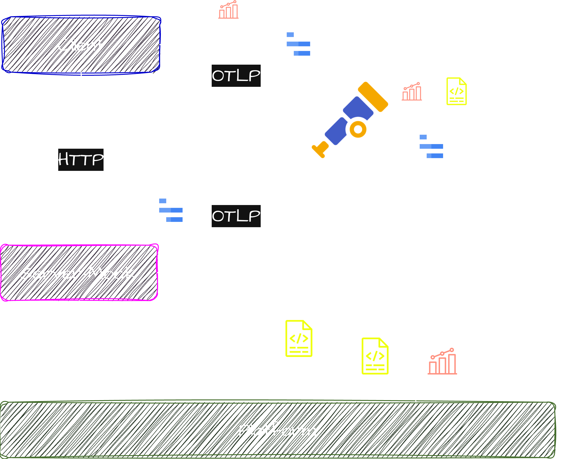

# cnd-workshop-2026
Repo with guide and assets to follow the 2026 CND Romania workshop: Observability unlocked with
OpenTelemetry and the VictoriaMetrics Stack

# Abstract

Observability doesn’t have to be hard. In this hands-on workshop, we’ll show how to go from zero to
Kubernetes observability in minutes with Open Source projects like VictoriaMetrics, AlertManager,
OpenTelemetry or Grafana.

This will be done with practical, live examples. We’ll learn how to generate, process and export
metrics and logs by:
* Deploying a demo app, collecting data with OpenTelemetry collectors and
exporting them with proper authentication
* Exploring metrics cardinality and integrating dashboards with Grafana
* Learn metrics and logs dynamics over time to improve quality and maintenance of our observability
setup with anomaly detection mechanisms
* Create alerts and get notified before problems escalate
* We’ll give a preview of distributed tracing with VictoriaTraces
* We’ll also cover log visualization and aggregation, together with metrics generation from other
signals

By the end, you’ll have the knowledge to build a production-grade observability stack from scratch - fast, reliable, and scalable.

# Links
* Workshop link: https://cloudnativedays.ro/workshops/a130c5e1-fe82-4b06-93c9-c5f65a3e6d9d
* Repo link: https://github.com/jgomezselles/cnd-workshop-2026

# TODOs
- [ ] Presentation

# Requirements

## Tooling
* Docker (tested on versions:  Client - 28.2.2 , Server 29.4.0)
* Docker compose (tested on version v2.13.0)
* POSIX shell for helper scripts: Linux/macOS Terminal or WSL 2 on Windows
* Small k8s distro: minikube, kind or similar
* kubectl: (tested on version: v1.33.1)
* Helm: (tested on version: v3.18.1)

# Part I

In this first part, we will first cover the fundamentals of OpenTelemetry, and how to configure an
OpenTelemetry Collector to gather k8s platform metrics. After that, we will talk about
Instrumentation, and deploy a demo app. We will be sending metrics and logs to a remote backend,
and finally observe our app by integrating with Grafana.

## [1. OpenTelemetry Introduction](1_1_OpenTelemetry_Intro)

Here, we will start with the basics: what OpenTelemetry is, a vendor-neutral collection of APIs,
SDKs, and tools for generating, collecting, and exporting metrics, traces, and logs. We will then
look at the OTel Collector as a central, backend-agnostic pipeline component, and install it on
Kubernetes via Helm using the contrib image. We will walk through the key configuration sections
(receivers, processors, exporters, connectors, and service pipelines) and see how Kubernetes
presets (`clusterMetrics`, `kubeletMetrics`, `kubernetesAttributes`) take care of the complex setup
for us. We will finish with a first look at debugging the collector using the zpages extension.

## [2. Forwarding Metrics](1_2_Forwarding_Metrics)

In section 2, we will connect our OTel Collector to a remote VictoriaMetrics Cloud backend using bearer
token authentication and an `otlphttp` exporter. We will walk through obtaining credentials from
the Cloud console, plugging them into our values file, and upgrading the Helm release to apply the
changes. Then, we will explore the collected Kubernetes metrics in the VictoriaMetrics UI (`vmui`),
including a first look at cardinality and our first MetricsQL queries for CPU and memory usage.

## [3. Instrumentation](1_3_Instrumentation)

Now that we know the basics, we're ready to run our first app! we will explain the three main
approaches to automatic OpenTelemetry instrumentation:
eBPF-based, bytecode injection for managed runtimes, and library auto-instrumentation via
environment variables.

In this case, we will use manual instrumentation: we will also explain why C++ requires this,
and will be using the OTel SDK directly. Then, we will deploy our demo application: `Hermes` (a C++
load generator instrumented by hand) and `ServerMock` (a Go service using auto-instrumentation via
environment variables). We will also extend the OTel Collector with traces and logs pipelines to
receive the new signals from both apps.

## [4. Forwarding Logs](1_4_Forwarding_Logs)

Now that we're experts on metrics, we will enable the `kubernetesEvents` and `logsCollection` presets
to collect Kubernetes API events and container stdout logs via the `k8sobjectreceiver` and `filelogreceiver`.
We will then configure a new `otlphttp` exporter targeting VictoriaLogs, with tenant identification
via headers and stream field definitions to group logs by container name. Finally, we will explore
our logs in the VictoriaLogs UI and write our first LogsQL queries (time filters, keyword search,
sorting, and `count()` stats).

## [5. Dashboards](1_5_Dashboards)

Finally, we will install Grafana with the `Prometheus` and `VictoriaLogs` connections and configure both
as data sources using the Cloud integration guide. We will then load a pre-built Hermes dashboard
provisioned as a ConfigMap, with panels for response time graphs, success rate gauges, and
per-stream log hit counts. We will finish by inspecting and editing panels to understand the
MetricsQL and LogsQL queries behind each visualization, and try creating a new panel from scratch.

## Next steps

The following (not-documented-but-hopefully-soon) repo contains this app with the 3 backends to be run
locally. Feel free to download and play with it! https://github.com/jgomezselles/vm-app-stack

# Part II

Next part deals with **Anomaly Detection**. Move to the [anomaly-detection](anomaly-detection)
folder to continue!