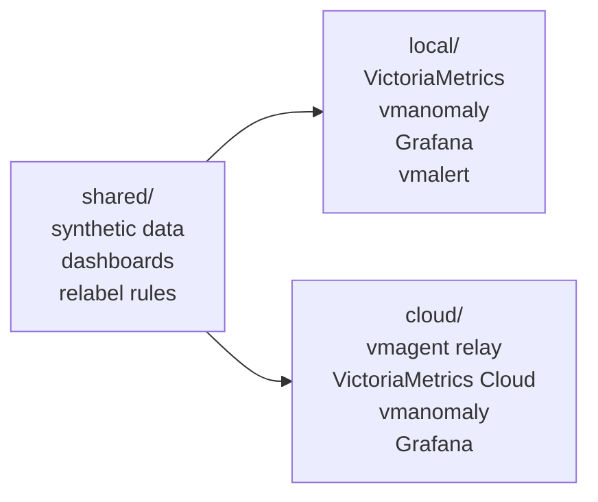
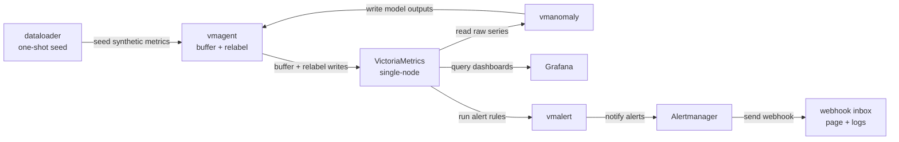
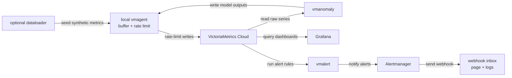
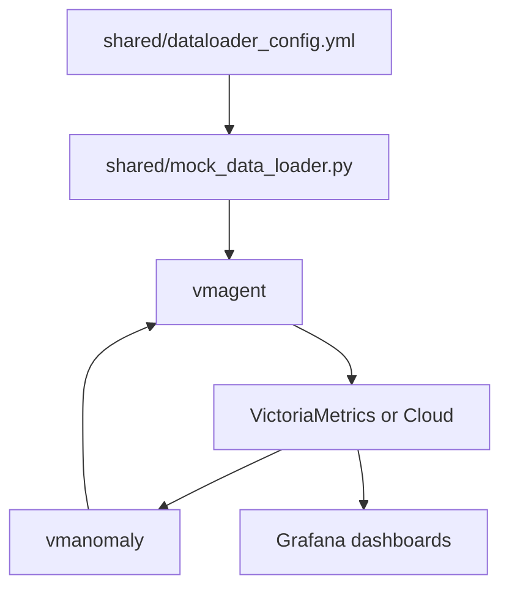

# Part II - Anomaly Detection

This part of the CND workshop uses a fully synthetic, OpenTelemetry-style APM
dataset to show how VictoriaMetrics Anomaly Detection (`vmanomaly`) can detect
latency, traffic, and error-rate anomalies.

The goal is to keep the demo reproducible while still looking close to a real
application monitoring setup: service labels follow simple OTEL naming, metric
names describe business behavior, and generated time series keep stable IDs
across historical and future timestamps.

## What we will run

There are two deployment modes:

* **Local mode**: runs VictoriaMetrics, vmagent, vmanomaly, Grafana, vmalert,
  Alertmanager, and the optional synthetic dataloader on your machine.
* **Cloud mode**: skips local VictoriaMetrics and writes/reads through a
  VictoriaMetrics Cloud deployment. vmagent still runs locally to buffer,
  relabel, and rate-limit ingestion bursts.



## Folder structure

```text
anomaly-detection/
  .secret/                 # credentials and license files, never committed
  shared/                  # generator, shared dashboards, common env, relabeling
  local/                   # self-contained Docker Compose stack
  cloud/                   # VictoriaMetrics Cloud Docker Compose stack
```

Important shared files:

* `shared/dataloader_config.yml`: synthetic OTEL APM metric definitions.
* `shared/mock_data_loader.py`: one-shot generator that writes history and a
  small future window.
* `shared/vmagent-relabel.yml`: relabeling used to make backfill and periodic
  vmanomaly outputs look like one continuous production scheduler.
* `shared/provisioning/dashboards/`: Grafana dashboards used by both modes.

## Requirements

You need:

* Docker Engine
* Docker Compose v2 (`docker compose`)
* a vmanomaly license file
* for Cloud mode only: VictoriaMetrics Cloud query URL and bearer token

Check versions:

```sh
docker version
docker compose version
```

### Installing Docker

Linux:

```sh
curl -fsSL https://get.docker.com | sh
sudo usermod -aG docker "$USER"
```

Log out and back in after adding your user to the `docker` group.

macOS:

Install Docker Desktop from https://www.docker.com/products/docker-desktop/.

Windows:

Install Docker Desktop with the WSL 2 backend from
https://www.docker.com/products/docker-desktop/.

## Secrets

Create the local secret directory from the repository root:

```sh
mkdir -p anomaly-detection/.secret
```

Required for both modes:

```text
anomaly-detection/.secret/license
```

Required for Cloud mode:

```text
anomaly-detection/.secret/BEARER_TOKEN_READ
anomaly-detection/.secret/BEARER_TOKEN_WRITE
anomaly-detection/.secret/datasource_url
anomaly-detection/.secret/read_tenant_id
anomaly-detection/.secret/write_tenant_id
```

For initial verification, set both `read_tenant_id` and `write_tenant_id` to
the same tenant, for example `0:101`. After the read/write path is confirmed,
organizers can keep raw synthetic APM metrics in a shared read tenant and move
vmanomaly outputs plus self-monitoring metrics to individual participant
tenants such as `1:0`, `2:0`, and so on.

Optional Cloud overrides:

```text
anomaly-detection/.secret/grafana_datasource_url
anomaly-detection/.secret/remote_write_url
```

These files are ignored by git.

## Architecture

Local mode:



Cloud mode:



## Start local mode

Local mode is the easiest path for a clean workshop run. It resets Docker
volumes by default and runs the dataloader once.

```sh
cd anomaly-detection/local
./up.sh
```

Useful variants:

```sh
./up.sh --skip-dataloader --keep-volumes
./up.sh --with-dataloader --keep-volumes
./up.sh --reset-volumes
```

Open:

* Grafana: http://localhost:3000
* VictoriaMetrics: http://localhost:8428
* vmanomaly UI: http://localhost:8490
* vmalert: http://localhost:8880
* Alertmanager: http://localhost:9093
* Alert webhook inbox: http://localhost:5001

Follow logs:

```sh
docker compose logs -f dataloader
docker compose logs -f vmanomaly
docker compose logs -f vmagent
docker compose logs -f alert-webhook
```

Stop:

```sh
./down.sh
```

Keep local Docker volumes:

```sh
./down.sh --keep-volumes
```

See [local/README.md](./local/README.md) for local-specific notes.

## Start Cloud mode

Cloud mode is useful after metrics were already pushed to VictoriaMetrics Cloud
or when testing the cloud query/write path.

```sh
cd anomaly-detection/cloud
./up.sh
```

Seed Cloud with the synthetic dataset before starting vmanomaly:

```sh
./up.sh --with-dataloader
```

For participant runs this is normally skipped because raw synthetic data is
expected to already exist in the shared read tenant.

Open:

* Grafana: http://localhost:3000
* vmanomaly UI: http://localhost:8490
* vmagent: http://localhost:8429
* vmalert: http://localhost:8880
* Alertmanager: http://localhost:9093
* Alert webhook inbox: http://localhost:5001

## Inspect in Grafana

Once vmanomaly is running, open Grafana and use the provisioned dashboards:

* The anomaly score dashboard helps explore model output: raw input copied by
  vmanomaly as `y`, predicted values as `yhat`, confidence bands, and
  `anomaly_score` per query/model. Full guide:
  https://docs.victoriametrics.com/anomaly-detection/presets/#grafana-dashboard
* The self-monitoring dashboard helps check whether vmanomaly is healthy:
  scheduler/model run times, errors, data reads/writes, and service metrics.
  Full guide:
  https://docs.victoriametrics.com/anomaly-detection/self-monitoring/

Stop local cloud-mode containers:

```sh
./down.sh
```

This does not delete any data from VictoriaMetrics Cloud.

See [cloud/README.md](./cloud/README.md) for Cloud-specific notes.

## Synthetic dataset

The dataloader writes synthetic APM metrics such as checkout latency, checkout
request rate, and payment error ratio. Labels are intentionally simple and
stable so dashboard users can reason about the application shape quickly.



The generator keeps `synthetic_series_id`, `instance`, and
`service_instance_id` consistent across historical and future timestamps. This
avoids cold-start-looking label drift when the demo queries historical data and
then continues into already-written future data.
