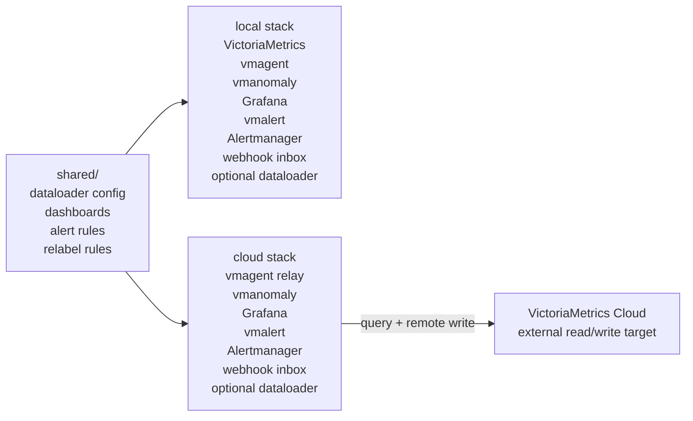
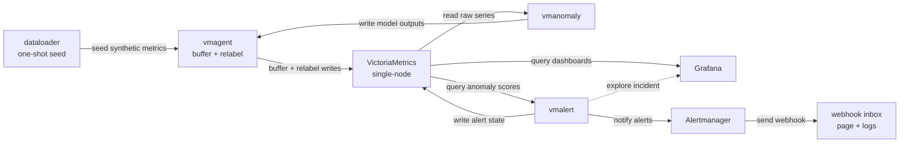
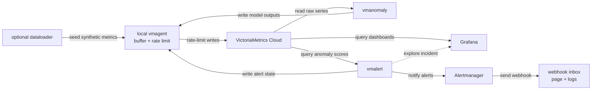
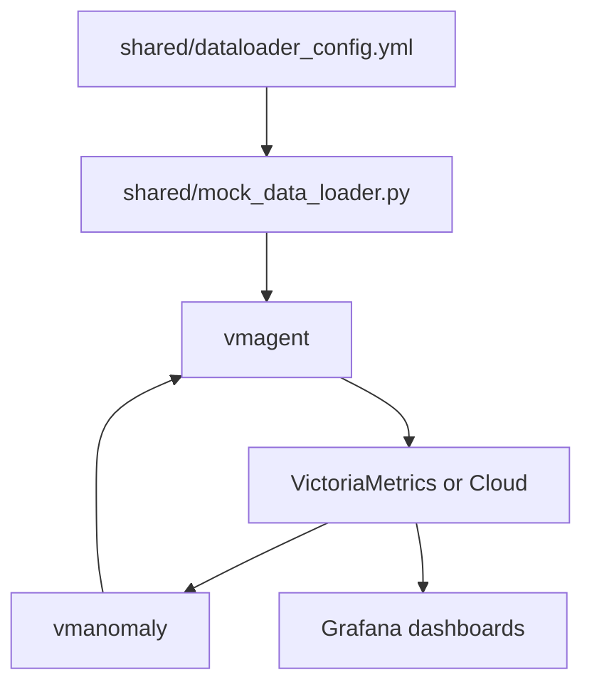

<a id="toc"></a>

# Part II - Anomaly Detection

This part of the CND workshop uses a small, fully synthetic, OpenTelemetry-style APM
dataset to show how VictoriaMetrics Anomaly Detection (`vmanomaly`) can detect
latency, traffic, and error-rate anomalies.

The goal is to keep the demo reproducible while still looking close to a real
application monitoring setup: service labels follow simple OTEL naming, metric
names describe business behavior, and generated time series keep a stable
`instance` label across historical and future timestamps.

## Table of contents

- [From telemetry to decisions](#from-telemetry-to-decisions)
- [Workshop roadmap](#workshop-roadmap)
- [What we will run](#what-we-will-run)
- [Component overview](#component-overview)
- [Folder structure](#folder-structure)
- [Requirements](#requirements)
- [Secrets](#secrets)
- [Architecture](#architecture)
- [Run the demo](#run-the-demo)
- [Explore data and AD concepts](#explore-data-and-ad-concepts)
- [Grafana exercises](#grafana-exercises)
- [Alerts and notifications](#alerts-and-notifications)
- [Appendix: Synthetic dataset](#synthetic-dataset)
- [Stop](#stop)

## From telemetry to decisions

Part I of the workshop showed how to instrument services, collect telemetry,
and send it to a time-series (VictoriaMetrics) or logs (VictoriaLogs) database, using OpenTelemetry and VictoriaMetrics cloud. 
**That is the foundation, but the operating journey does not end at ingestion: teams still need to turn that data into decisions, dashboards, and alerts that are useful under production conditions.**

This part adds anomaly detection on top of the same monitoring loop. We will
start from synthetic APM data, learn what normal behavior looks like, inspect
model outputs, and then use the resulting anomaly scores in Grafana and
vmalert. The focus is practical: static alerting rules often fail when signals
have trend, seasonality, unknown scale, or many returned time series where one
global threshold does not fit every service or instance.

> **Note:** For the hands-on flow we use the **local stack** first because it is easier to
reset and does not depend on participant-specific cloud credentials. The local
data, labels, models, dashboards, and alert rules intentionally mirror the
cloud flow. Cloud mode adds multitenant routing and `.secret` files, but the
observations and exercises are the same.

[Back to ToC](#toc)

## Workshop roadmap

1. **Installation basics:** install Docker, verify Docker Compose, clone the
   repo, and prepare the `.secret` files.
2. **Setup overview:** review local/cloud components, how data moves, and which
   services are responsible for ingestion, modeling, dashboards, rules, and
   notifications.
3. **Run the demo:** choose local or cloud mode. Local seeds data by default;
   cloud usually reuses organizer-provided raw data and participant-specific
   write tenants.
4. **Explore the OTEL APM demo stack:**
   - **4.1** inspect historical raw queries and AD concepts in the vmanomaly UI
   - **4.2** explore anomaly scores in Grafana
   - **4.3** briefly check vmanomaly self-monitoring
   - **4.4** inspect vmalert rules and firing alerts
   - **4.5** open Alertmanager and the local webhook notification page
5. **Wrap up:** connect the demo back to the operating model: raw signals,
   expected behavior, anomaly scores, alert grouping, and human judgment.

[Back to ToC](#toc)

## What we will run

There are two deployment modes:

- **Local mode:** runs VictoriaMetrics, vmagent, vmanomaly, Grafana, vmalert,
  Alertmanager, and the webhook inbox on your machine. The synthetic
  dataloader is available through the `seed` profile and runs by default from
  `local/up.sh`.
- **Cloud mode:** skips local VictoriaMetrics. vmanomaly and vmalert read from
  VictoriaMetrics Cloud, while vmanomaly, vmalert, and the optional dataloader
  write through local vmagent so writes can be buffered, relabeled, and
  rate-limited. Grafana, Alertmanager, and the webhook inbox still run locally
  on cloud-specific host ports.

In the workshop cloud layout, raw synthetic data is expected in the shared read
tenant `1000:0`. Participant outputs are written to individual tenants such as
`10:1`, `10:2`, ... `10:N`. This keeps the expensive shared seed data common
while each participant can write vmanomaly outputs, vmalert state, and
self-monitoring metrics into their own tenant.



[Back to ToC](#toc)

## Component overview

| Component | Aim | What it does in this workshop | Docs |
|-----------|-----|-------------------------------|------|
| VictoriaMetrics TSDB | Time series database and MetricsQL query engine. | Stores raw synthetic APM metrics and vmanomaly outputs in local mode. | [VictoriaMetrics](https://docs.victoriametrics.com/victoriametrics/) |
| VictoriaMetrics Cloud | Managed VictoriaMetrics service. | Stores shared raw data and participant write data in cloud mode. | [VictoriaMetrics Cloud](https://docs.victoriametrics.com/victoriametrics-cloud/) |
| vmagent | Lightweight metrics collector, relay, buffer, and remote-write agent. | Receives writes from the dataloader, vmanomaly, and vmalert; buffers, relabels, rate-limits, and forwards samples. | [vmagent](https://docs.victoriametrics.com/victoriametrics/vmagent/) |
| vmanomaly | Anomaly detection component for time series. | Reads raw APM time series, fits/runs anomaly models, and writes model outputs such as `y`, `yhat`, confidence bands, and `anomaly_score`; this workshop stores them with the `otel_apm_` metric prefix. | [Anomaly Detection](https://docs.victoriametrics.com/anomaly-detection/) |
| vmanomaly UI | Interactive UI for anomaly-detection configuration and exploration. | Lets you inspect configured queries and run/finetune models on historical incidents before it goes to production. | [Anomaly Detection UI](https://docs.victoriametrics.com/anomaly-detection/ui/) |
| Grafana | Dashboarding and visualization layer. | Shows the anomaly score dashboard and vmanomaly self-monitoring dashboard. | [Grafana docs](https://grafana.com/docs/grafana/latest/) |
| vmalert | Rule evaluator for alerts and recording rules. | Evaluates alerting rules against anomaly scores and sends firing alerts to Alertmanager. | [vmalert](https://docs.victoriametrics.com/victoriametrics/vmalert/) |
| Alertmanager | Alert grouping, deduplication, silencing, and routing service. | Groups vmalert notifications and routes them to the local webhook inbox. | [Alertmanager](https://prometheus.io/docs/alerting/latest/alertmanager/) |
| Webhook inbox | Minimal local HTTP receiver for demo notifications. | Receives Alertmanager webhook JSON and displays it without Slack or email credentials. | local helper |
| Dataloader | Synthetic data generator. | Writes deterministic APM history and a near-future window. | [shared/mock_data_loader.py](./shared/mock_data_loader.py) |

[Back to ToC](#toc)

## Folder structure

```text
anomaly-detection/
  .secret/                 # credentials and license files, never committed
  shared/                  # generator, shared dashboards, common env, relabeling
  local/                   # self-contained Docker Compose stack
  cloud/                   # VictoriaMetrics Cloud Docker Compose stack
```

Important shared files:

- `shared/dataloader_config.yml`: synthetic OTEL APM metric definitions.
- `shared/mock_data_loader.py`: one-shot generator that writes history and a
  small future window.
- `shared/vmagent-relabel.yml`: relabeling used to make backfill and periodic
  vmanomaly outputs look like one continuous production scheduler.
- `shared/vmalert_config.yml`: anomaly-score alerting rules.
- `shared/provisioning/dashboards/`: Grafana dashboards used by both modes.

[Back to ToC](#toc)

## Requirements

You need:

- Docker Engine
- Docker Compose v2 (`docker compose`)
- a POSIX shell for helper scripts: Linux/macOS Terminal or WSL 2 on Windows
- a vmanomaly license file
- for Cloud mode only: VictoriaMetrics Cloud query URL, tenant IDs, and bearer
  tokens supplied by organizers

Verify Docker from a console before the workshop:

```sh
docker version
docker compose version
```

Expected result:

- `docker version` prints both `Client` and `Server` sections. If the `Server`
  section is missing or says it cannot connect, Docker Desktop or Docker Engine
  is not running.
- `docker compose version` prints Docker Compose v2, for example
  `Docker Compose version v2.x.x`. This workshop uses the v2 plugin command
  `docker compose`, not the legacy standalone `docker-compose` command.

Optional quick runtime check:

```sh
docker run --rm hello-world
```

This should pull and run the tiny Docker test image successfully.

### Installing Docker

Linux:

```sh
curl -fsSL https://get.docker.com | sh
sudo usermod -aG docker "$USER"
```

Log out and back in after adding your user to the `docker` group.

macOS:

Install Docker Desktop from https://www.docker.com/products/docker-desktop/.

Windows:

Install Docker Desktop with the WSL 2 backend from
https://www.docker.com/products/docker-desktop/.

Docker Compose installation details are available in the official
[Docker Compose docs](https://docs.docker.com/compose/install/).

[Back to ToC](#toc)

## Secrets

Create the local secret directory from the repository root:

```sh
mkdir -p anomaly-detection/.secret
```

Required for both modes:

```text
anomaly-detection/.secret/license
```

Required for Cloud mode:

```text
anomaly-detection/.secret/BEARER_TOKEN_READ
anomaly-detection/.secret/BEARER_TOKEN_WRITE
anomaly-detection/.secret/datasource_url
anomaly-detection/.secret/read_tenant_id
anomaly-detection/.secret/write_tenant_id
```

> **Note:** In cloud mode, organizers should provide the shared
> `license`, `datasource_url`, read bearer token, write bearer token, and the
> shared read tenant ID. For the planned workshop flow, the shared raw-data
> tenant is `1000:0`, while each participant gets an assigned write tenant such
> as `10:1`, `10:2`, ... `10:N`. For initial end-to-end verification,
> organizers may ask everyone to use the same read and write tenant
> temporarily. In split mode, vmanomaly reads raw input from the read tenant and
> writes anomaly outputs to the write tenant; vmalert and Grafana query anomaly
> outputs and self-monitoring metrics from the participant write tenant using a
> read-capable token.

Optional Cloud overrides:

```text
anomaly-detection/.secret/grafana_datasource_url
anomaly-detection/.secret/remote_write_url
```

[Back to ToC](#toc)

## Architecture

Local mode:



Cloud mode:



[Back to ToC](#toc)

## Run the demo

### Start local mode

Local mode is the easiest path for a clean workshop run. It resets Docker
volumes by default and runs the dataloader once.

```sh
cd anomaly-detection/local
./up.sh
```

Useful variants:

```sh
./up.sh --skip-dataloader --keep-volumes
./up.sh --with-dataloader --keep-volumes
./up.sh --reset-volumes
```

Open:

- Grafana: http://localhost:3000
- VictoriaMetrics: http://localhost:8428
- vmanomaly UI: http://localhost:8490
- vmalert: http://localhost:8880
- Alertmanager: http://localhost:9093
- Alert webhook inbox: http://localhost:5001

### Start Cloud mode

Cloud mode is useful after metrics were already pushed to VictoriaMetrics Cloud
or when testing the cloud query/write path.

> **Note:** Cloud uses a different host port range, so local and cloud stacks
> can run at the same time. If you still have cloud containers created before
> this port split, run
> `cd anomaly-detection/cloud && ./down.sh --keep-volumes` once before starting
> local mode again.

```sh
cd anomaly-detection/cloud
./up.sh
```

Seed Cloud with the synthetic dataset before starting vmanomaly:

```sh
./up.sh --with-dataloader
```

For participant runs this is normally skipped because raw synthetic data is
expected to already exist in the shared read tenant.

Open:

- Grafana: http://localhost:13000
- vmanomaly UI: http://localhost:18490
- vmagent: http://localhost:18429
- vmalert: http://localhost:18880
- Alertmanager: http://localhost:19093
- Alert webhook inbox: http://localhost:15001

Follow logs:

```sh
docker compose logs -f dataloader
docker compose logs -f vmanomaly
docker compose logs -f vmagent
docker compose logs -f vmalert
docker compose logs -f alert-webhook
```

See [local/README.md](./local/README.md) and
[cloud/README.md](./cloud/README.md) for mode-specific notes.

[Back to ToC](#toc)

## Explore data and AD concepts

Start in the vmanomaly UI before looking at Grafana. This is where raw
MetricsQL queries, anomaly-detection terms, and model outputs connect to each
other. The UI is documented in the official
[vmanomaly UI guide](https://docs.victoriametrics.com/anomaly-detection/ui/).

The walkthrough order is:

1. Run a few raw `apm_` queries to understand the synthetic service signals.
2. Run the premade server queries exposed by vmanomaly from the `reader`
   section ("Query history" tab) to see the exact queries used for modeling and
   alerting.
3. Name the concepts visible in the data: seasonality, trend, changepoint,
   contextual anomaly, and slow trend.
4. Tune and run a simple anomaly-detection model in the UI, for example a
   Median-absolute-deviation (MAD)-style robust baseline, then apply basic domain knowledge such as detection direction or a minimum meaningful deviation.

<details>
<summary>AD terms used in this walkthrough</summary>

- **Trend:** a persistent direction of change, such as traffic slowly dropping
  over a few hours.
- **Seasonality:** a repeating pattern, such as lower weekend checkout traffic
  or daily peaks around working hours.
- **Changepoint:** a step-like shift in the normal level, such as latency
  becoming 1.6x higher and staying there.
- **Contextual anomaly:** a point or short window that is unusual for its
  context, such as a request-rate drop during a normal peak hour.
- **Slow trend anomaly:** a gradual change that is not obvious from a single
  point but becomes problematic over a window.

Static alerts on raw metrics often fail short for seasonal and trending data:
a fixed latency threshold can be too noisy during peaks and too insensitive
during quiet periods. They also become awkward when one query returns many
time series with unknown or incompatible scale, for example request rates for
many services instead of a bounded CPU utilization percentage. A single static
threshold rarely fits every service, route, region, or instance. ML-based
anomaly detection can learn expected behavior per series and emit a unified
`anomaly_score`, so alerting rules can be simpler and more stable, for example
`anomaly_score > 1`. This is not a replacement for domain knowledge; it is a
way to encode expected dynamics and reduce alert rule maintenance and alert
fatigue. For concise product framing, see the first two sections of the
VictoriaMetrics Anomaly Detection docs:
[What does it do?](https://docs.victoriametrics.com/anomaly-detection/#what-does-it-do)
and
[How does it work?](https://docs.victoriametrics.com/anomaly-detection/#how-does-it-work).

</details>

In the query history modal, use the **Server Queries** tab to replay configured
queries such as:

```promql
max(apm_http_server_request_duration_seconds_p95{
  service_namespace="shop",
  service_name="checkout-api",
  http_route="/checkout"
}) without (service_version)
```

```promql
max(apm_rpc_client_error_ratio{
  service_namespace="shop",
  service_name="checkout-api",
  peer_service="payment-service"
}) without (service_version)
```

```promql
sum(rate(apm_http_server_request_count_total{
  service_namespace="shop",
  service_name="checkout-api",
  http_route="/checkout"
}[2m])) without (service_version)
```

Use a historical range first, then include the near-future window to see how
already-written samples can imitate a live demo.

While looking at the raw signals, connect them back to the terms from the
primer: smooth daily/weekly seasonality, persistent changepoints, contextual
spikes or drops, and slow trends. Then run or discuss a simple robust baseline,
such as MAD, to see how an anomaly model turns raw input into reusable output
series.

The important output labels and metrics are:

- `for`: the configured query alias, such as `checkout_latency_p95`,
  `checkout_request_rate`, or `payment_error_ratio`.
- `y`: the value vmanomaly used as model input for a given timestamp.
- `yhat`: the model's expected value.
- `yhat_lower` and `yhat_upper`: the expected band around `yhat`, when the
  model provides one.
- `anomaly_score`: the normalized score (0 to 1 - likely normal, > 1 - likely anomalous) consumed by Grafana panels and vmalert
  rules.

After this, the Grafana anomaly dashboard is easier to read because each line
has a clear role: raw signal, expected behavior, uncertainty band, or alerting
score.

Domain tuning should stay practical: error ratio is bounded between `0` and
`1`, request rate cannot be negative, latency and error-rate spikes are usually
bad, and traffic drops often matter only during expected active periods. The
goal is to translate business assumptions into model behavior, not to memorize
configuration keys. See the VictoriaMetrics FAQ section on
[incorporating domain knowledge](https://docs.victoriametrics.com/anomaly-detection/faq/#incorporating-domain-knowledge)
for the same idea in product documentation.

[Back to ToC](#toc)

## Grafana exercises

Once vmanomaly is running, open Grafana and use the provisioned dashboards:

- The anomaly score dashboard helps explore model output: raw input copied by
  vmanomaly as `y`, predicted values as `yhat`, confidence bands, and
  `anomaly_score` per query/model. Full guide:
  https://docs.victoriametrics.com/anomaly-detection/presets/#grafana-dashboard
- The self-monitoring dashboard helps check whether vmanomaly is healthy:
  scheduler/model run times, errors, data reads/writes, and service metrics.
  Full guide:
  https://docs.victoriametrics.com/anomaly-detection/self-monitoring/

### 1. Find the slow checkout instance

In Grafana, open the anomaly score dashboard and set:

- `query_key`: `checkout_latency_p95`
- `groupby`: `instance`
- time range: recent 6 hours

Questions:

- Which instance has a persistent latency problem?
- Which instances have shorter contextual latency incidents?
- Is any latency incident already present in the generated future window?

<details>
<summary>Hint / answer</summary>

`checkout-api-2` has a persistent latency changepoint around `now()-3h`.
`checkout-api-0` has a contextual latency incident around `now()-1h`.
`checkout-api-1` has a shorter contextual latency incident around `now()-30m`.
One latency incident is placed shortly after `now()`, so it appears as the
demo time range moves into already-written future samples.

</details>

### 2. Traffic is not just seasonal

Set:

- `query_key`: `checkout_request_rate`
- `groupby`: `instance`
- time range: recent 6 hours

Questions:

- Which instance is slowly losing traffic?
- Which instance has a shorter traffic drop?
- Why is this different from regular weekday/weekend or intraday seasonality?

<details>
<summary>Hint / answer</summary>

`checkout-api-1` has a slow traffic decay. It is gradual, so it is more subtle
than a spike. `checkout-api-0` has a shorter contextual traffic drop. The key
difference from seasonality is that the drop happens off the learned smooth
daily/weekly pattern and does not repeat like normal traffic.

</details>

### 3. Payment errors are adding up

Set:

- `query_key`: `payment_error_ratio`
- `groupby`: `instance`
- time range: recent 6 hours

Questions:

- Which instance has a slow error-rate buildup?
- Which spikes are short contextual incidents?
- Can you see a forthcoming payment error spike?

<details>
<summary>Hint / answer</summary>

`checkout-api-1` has a slow payment error-rate buildup. All instances have
smaller contextual spikes in the generated data, and one spike is placed
shortly after `now()` to demonstrate a forthcoming incident in the
already-written future window.

</details>

[Back to ToC](#toc)

## Alerts and notifications

Inspect the alerting path after anomaly scores are visible:

1. Open the `shared/vmalert_config.yml` rule and identify the expression using
   `otel_apm_anomaly_score`.
2. Open vmalert and check whether `APMAnomalyScoreHigh` is pending or firing.
3. Open Alertmanager and confirm the alert is grouped and active.
4. Open the webhook inbox and inspect the JSON notification.
5. Use the alert `Source link` to jump to the Grafana anomaly-score dashboard
   filtered to the alert's `for` query alias.

Open:

- Local vmalert: http://localhost:8880
- Local Alertmanager: http://localhost:9093
- Local webhook inbox: http://localhost:5001
- Cloud vmalert: http://localhost:18880
- Cloud Alertmanager: http://localhost:19093
- Cloud webhook inbox: http://localhost:15001

Questions:

- Which alert rule is firing?
- Which affected checkout signal does the alert point to, and which instance
  would you investigate first?
- Does the webhook page show grouped notifications from Alertmanager?

The workshop rule intentionally groups by the business result instead of the
vmanomaly implementation detail:

```promql
max without (model_alias, scheduler_alias) (
  max_over_time(otel_apm_anomaly_score[2m])
) > 1
```

This keeps one alert identity per affected service/query/instance even if two
models or schedulers produce anomaly scores for the same raw time series.
Alertmanager then groups notifications by `alertname`, `severity`,
`service_namespace`, `service_name`, `business_flow`, and `for`, while keeping
individual `instance` labels inside the grouped notification for debugging.
The alert source link opens Grafana with `query_key` and an ad hoc
`for = <query alias>` filter already set.

<details>
<summary>Hint / answer</summary>

The workshop rule is `APMAnomalyScoreHigh`. vmalert evaluates the prefixed
`otel_apm_anomaly_score` metric, sends firing alerts to Alertmanager, and
Alertmanager sends grouped JSON notifications to the local webhook inbox. The
rule collapses `model_alias` and `scheduler_alias`, so two models or schedulers
do not create duplicate alert identities for the same business entity. Use
`for` to identify the affected query or business signal, `service_name` and
`business_flow` to understand the product area, and `instance` to find the
specific checkout instance to inspect first.

</details>

[Back to ToC](#toc)

## Synthetic dataset

The dataloader writes synthetic APM metrics such as checkout latency, checkout
request rate, and payment error ratio. Labels are intentionally simple and
stable so dashboard users can reason about the application shape quickly.



The generator keeps the `instance` label consistent across historical and
future timestamps. This avoids cold-start-looking label drift when the demo
queries historical data and then continues into already-written future data.

`shared/dataloader_config.yml` is scenario-based:

- `labels` holds shared OpenTelemetry-style labels. Label values may be scalars
  or per-series lists such as `instance: [checkout-api-0, checkout-api-1]`.
- `signal` defines the normal baseline from `base`, `scale`, optional
  `seasonalities` such as summed sinusoids and weekday/weekend modulation,
  optional trend components, and `noise`.
- `value_range` bounds generated values in metric units, for example `[0, 1]`
  for normalized ratios, `[0, 100]` for percentages, and `[0, inf]` for rates
  or durations. For counters, this range applies to generated increments before
  cumulative conversion.
- `anomalies` overlays deterministic incidents. Relative starts are resolved
  around the dataloader start time: `1h` means one hour ago, `30m` means thirty
  minutes ago, and `-5m` means five minutes into the generated future.
- Main incidents can target all series or a selected series, can have
  per-series starts, durations, and factors, and support `contextual`,
  `changepoint`, and `slow_trend` types.
- Low-grade historical anomalies use `placement: random`, short durations, and
  small factors. They make history realistic without overwhelming normal
  training behavior.

[Back to ToC](#toc)

## Stop

Local:

```sh
cd anomaly-detection/local
./down.sh
```

Cloud:

```sh
cd anomaly-detection/cloud
./down.sh
```

Cloud `down.sh` only stops local containers and volumes. It does not delete
anything from VictoriaMetrics Cloud.

[Back to ToC](#toc)
