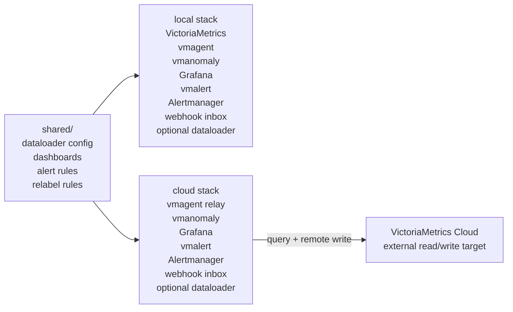
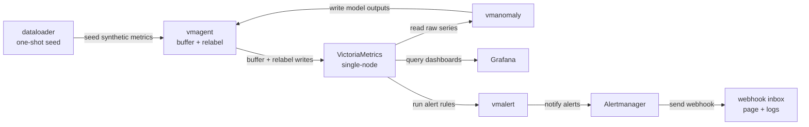
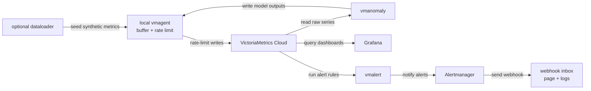
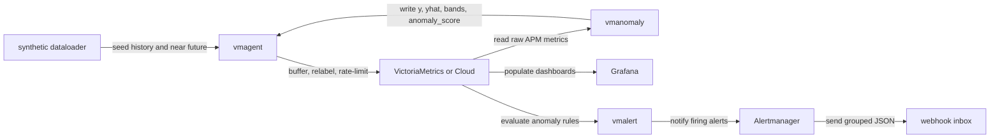
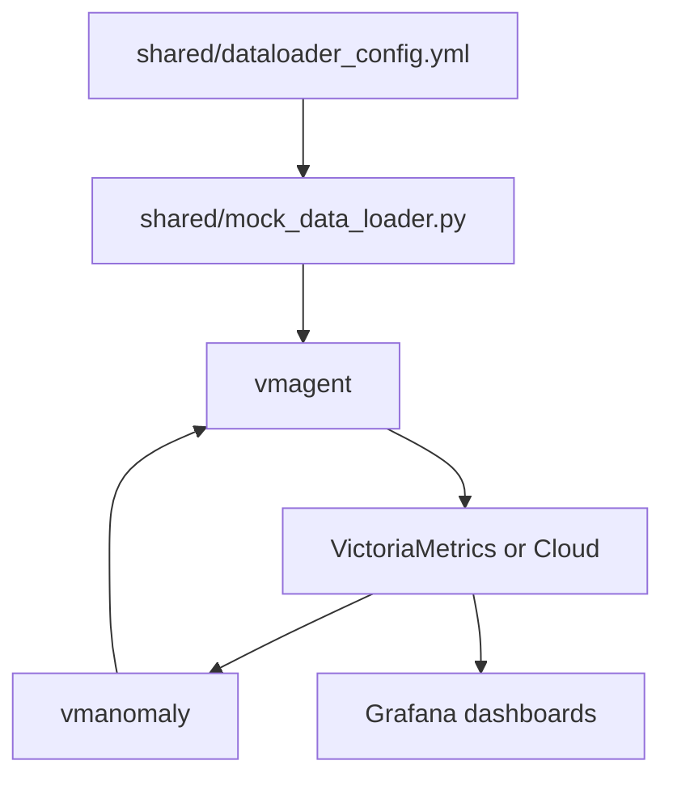

# Part II - Anomaly Detection

This part of the CND workshop uses a fully synthetic, OpenTelemetry-style APM
dataset to show how VictoriaMetrics Anomaly Detection (`vmanomaly`) can detect
latency, traffic, and error-rate anomalies.

The goal is to keep the demo reproducible while still looking close to a real
application monitoring setup: service labels follow simple OTEL naming, metric
names describe business behavior, and generated time series keep stable IDs
across historical and future timestamps.

## What we will run

There are two deployment modes:

* **Local mode**: runs VictoriaMetrics, vmagent, vmanomaly, Grafana, vmalert,
  Alertmanager, and the webhook inbox on your machine. The synthetic
  dataloader is available through the `seed` profile and runs by default from
  `local/up.sh`.
* **Cloud mode**: skips local VictoriaMetrics. vmanomaly and vmalert read from
  VictoriaMetrics Cloud, while vmanomaly, vmalert, and the optional dataloader
  write through local vmagent so writes can be buffered, relabeled, and
  rate-limited. Grafana, Alertmanager, and the webhook inbox still run locally
  on cloud-specific host ports.



## Folder structure

```text
anomaly-detection/
  .secret/                 # credentials and license files, never committed
  shared/                  # generator, shared dashboards, common env, relabeling
  local/                   # self-contained Docker Compose stack
  cloud/                   # VictoriaMetrics Cloud Docker Compose stack
```

Important shared files:

* `shared/dataloader_config.yml`: synthetic OTEL APM metric definitions.
* `shared/mock_data_loader.py`: one-shot generator that writes history and a
  small future window.
* `shared/vmagent-relabel.yml`: relabeling used to make backfill and periodic
  vmanomaly outputs look like one continuous production scheduler.
* `shared/provisioning/dashboards/`: Grafana dashboards used by both modes.

## Requirements

You need:

* Docker Engine
* Docker Compose v2 (`docker compose`)
* a vmanomaly license file
* for Cloud mode only: VictoriaMetrics Cloud query URL and bearer token

Check versions:

```sh
docker version
docker compose version
```

### Installing Docker

Linux:

```sh
curl -fsSL https://get.docker.com | sh
sudo usermod -aG docker "$USER"
```

Log out and back in after adding your user to the `docker` group.

macOS:

Install Docker Desktop from https://www.docker.com/products/docker-desktop/.

Windows:

Install Docker Desktop with the WSL 2 backend from
https://www.docker.com/products/docker-desktop/.

## Secrets

Create the local secret directory from the repository root:

```sh
mkdir -p anomaly-detection/.secret
```

Required for both modes:

```text
anomaly-detection/.secret/license
```

Required for Cloud mode:

```text
anomaly-detection/.secret/BEARER_TOKEN_READ
anomaly-detection/.secret/BEARER_TOKEN_WRITE
anomaly-detection/.secret/datasource_url
anomaly-detection/.secret/read_tenant_id
anomaly-detection/.secret/write_tenant_id
```

For initial verification, set both `read_tenant_id` and `write_tenant_id` to
the same tenant, for example `0:101`. After the read/write path is confirmed,
organizers can keep raw synthetic APM metrics in a shared read tenant and move
vmanomaly outputs plus self-monitoring metrics to individual participant
tenants such as `1:0`, `2:0`, and so on.

Optional Cloud overrides:

```text
anomaly-detection/.secret/grafana_datasource_url
anomaly-detection/.secret/remote_write_url
```

These files are ignored by git.

## Architecture

Local mode:



Cloud mode:



## Start local mode

Local mode is the easiest path for a clean workshop run. It resets Docker
volumes by default and runs the dataloader once.

```sh
cd anomaly-detection/local
./up.sh
```

Useful variants:

```sh
./up.sh --skip-dataloader --keep-volumes
./up.sh --with-dataloader --keep-volumes
./up.sh --reset-volumes
```

Open:

* Grafana: http://localhost:3000
* VictoriaMetrics: http://localhost:8428
* vmanomaly UI: http://localhost:8490
* vmalert: http://localhost:8880
* Alertmanager: http://localhost:9093
* Alert webhook inbox: http://localhost:5001

Follow logs:

```sh
docker compose logs -f dataloader
docker compose logs -f vmanomaly
docker compose logs -f vmagent
docker compose logs -f alert-webhook
```

Stop:

```sh
./down.sh
```

Keep local Docker volumes:

```sh
./down.sh --keep-volumes
```

See [local/README.md](./local/README.md) for local-specific notes.

## Start Cloud mode

Cloud mode is useful after metrics were already pushed to VictoriaMetrics Cloud
or when testing the cloud query/write path.

> **Note:** Cloud uses a different host port range, so local and cloud stacks can run at
the same time. If you still have cloud containers created before this port
split, run `cd anomaly-detection/cloud && ./down.sh --keep-volumes` once before
starting local mode again.

```sh
cd anomaly-detection/cloud
./up.sh
```

Seed Cloud with the synthetic dataset before starting vmanomaly:

```sh
./up.sh --with-dataloader
```

For participant runs this is normally skipped because raw synthetic data is
expected to already exist in the shared read tenant.

Open:

* Grafana: http://localhost:13000
* vmanomaly UI: http://localhost:18490
* vmagent: http://localhost:18429
* vmalert: http://localhost:18880
* Alertmanager: http://localhost:19093
* Alert webhook inbox: http://localhost:15001

## Inspect in Grafana

Once vmanomaly is running, open Grafana and use the provisioned dashboards:

* The anomaly score dashboard helps explore model output: raw input copied by
  vmanomaly as `y`, predicted values as `yhat`, confidence bands, and
  `anomaly_score` per query/model. Full guide:
  https://docs.victoriametrics.com/anomaly-detection/presets/#grafana-dashboard
* The self-monitoring dashboard helps check whether vmanomaly is healthy:
  scheduler/model run times, errors, data reads/writes, and service metrics.
  Full guide:
  https://docs.victoriametrics.com/anomaly-detection/self-monitoring/

## Workshop flow

The anomaly-detection part starts from a synthetic checkout service with three
instances:

- `checkout-api-0`
- `checkout-api-1`
- `checkout-api-2`

The dataset contains normal daily/weekly behavior, small historical blips, and
larger current or forthcoming incidents. Future samples are already written so
the workshop can imitate live data without waiting for real incidents.



Use these query aliases in the anomaly score dashboard:

| Query alias | Business question | Raw metric |
|-------------|-------------------|------------|
| `checkout_latency_p95` | Is checkout becoming slow? | `apm_http_server_request_duration_seconds_p95` |
| `checkout_request_rate` | Is traffic changing unexpectedly? | `rate(apm_http_server_request_count_total[2m])` |
| `payment_error_ratio` | Are payment failures increasing? | `apm_rpc_client_error_ratio` |

The normal shape is smooth: summed daily, half-daily, and sub-daily sinusoids
with weekday/weekend modulation and light noise. Historical anomalies are
shorter and less severe than the main incidents, so models still have mostly
normal data to learn from.

## Exercises

### 1. Find the slow checkout instance

In Grafana, open the anomaly score dashboard and set:

- `query_key`: `checkout_latency_p95`
- `groupby`: `instance`
- time range: recent 6 hours

Questions:

- Which instance has a persistent latency problem?
- Which instances have shorter contextual latency incidents?
- Is any latency incident already present in the generated future window?

<details>
<summary>Hint / answer</summary>

`checkout-api-2` has a persistent latency changepoint around `now()-3h`.
`checkout-api-0` has a contextual latency incident around `now()-1h`.
`checkout-api-1` has a shorter contextual latency incident around `now()-30m`.
One latency incident is placed shortly after `now()`, so it appears as the
demo time range moves into already-written future samples.

</details>

### 2. Traffic is not just seasonal

Set:

- `query_key`: `checkout_request_rate`
- `groupby`: `instance`
- time range: recent 6 hours

Questions:

- Which instance is slowly losing traffic?
- Which instance has a shorter traffic drop?
- Why is this different from regular weekday/weekend or intraday seasonality?

<details>
<summary>Hint / answer</summary>

`checkout-api-1` has a slow traffic decay. It is gradual, so it is more subtle
than a spike. `checkout-api-0` has a shorter contextual traffic drop. The key
difference from seasonality is that the drop happens off the learned smooth
daily/weekly pattern and does not repeat like normal traffic.

</details>

### 3. Payment errors are adding up

Set:

- `query_key`: `payment_error_ratio`
- `groupby`: `instance`
- time range: recent 6 hours

Questions:

- Which instance has a slow error-rate buildup?
- Which spikes are short contextual incidents?
- Can you see a forthcoming payment error spike?

<details>
<summary>Hint / answer</summary>

`checkout-api-1` has a slow payment error-rate buildup. All instances have
smaller contextual spikes in the generated data, and one spike is placed
shortly after `now()` to demonstrate a forthcoming incident in the
already-written future window.

</details>

### 4. From anomaly score to alert

Open:

- Local Alertmanager: http://localhost:9093
- Local webhook inbox: http://localhost:5001
- Cloud Alertmanager: http://localhost:19093
- Cloud webhook inbox: http://localhost:15001

Questions:

- Which alert rule is firing?
- Which `instance`, `for`, and `model_alias` labels make the alert actionable?
- Does the webhook page show grouped notifications from Alertmanager?

<details>
<summary>Hint / answer</summary>

The workshop rule is `APMAnomalyScoreHigh`. vmalert evaluates the anomaly score
expression, sends firing alerts to Alertmanager, and Alertmanager sends grouped
JSON notifications to the local webhook inbox. The useful labels are
`instance`, `for`, `service_name`, `model_alias`, and `scheduler_alias`.

</details>

Stop local cloud-mode containers:

```sh
./down.sh
```

This does not delete any data from VictoriaMetrics Cloud.

See [cloud/README.md](./cloud/README.md) for Cloud-specific notes.

## Synthetic dataset

The dataloader writes synthetic APM metrics such as checkout latency, checkout
request rate, and payment error ratio. Labels are intentionally simple and
stable so dashboard users can reason about the application shape quickly.



The generator keeps the `instance` label consistent across historical and
future timestamps. This avoids cold-start-looking label drift when the demo
queries historical data and then continues into already-written future data.

`shared/dataloader_config.yml` is scenario-based:

- `labels` holds shared OpenTelemetry-style labels. Label values may be scalars
  or per-series lists such as `instance: [checkout-api-0, checkout-api-1]`.
- `signal` defines the normal baseline from `base`, `scale`, optional
  `seasonalities` such as summed sinusoids and weekday/weekend modulation,
  optional trend components, and `noise`.
- `value_range` bounds generated values in metric units, for example `[0, 1]`
  for normalized ratios, `[0, 100]` for percentages, and `[0, inf]` for rates
  or durations. For counters, this range applies to generated increments before
  cumulative conversion.
- `anomalies` overlays deterministic incidents. Relative starts are resolved
  around the dataloader start time: `1h` means one hour ago, `30m` means thirty
  minutes ago, and `-5m` means five minutes into the generated future.
- Main incidents can target all series or a selected series, can have per-series
  starts, durations, and factors, and support `contextual`, `changepoint`, and
  `slow_trend` types.
- Low-grade historical anomalies use `placement: random`, short durations, and
  small factors. They make history realistic without overwhelming normal
  training behavior.
