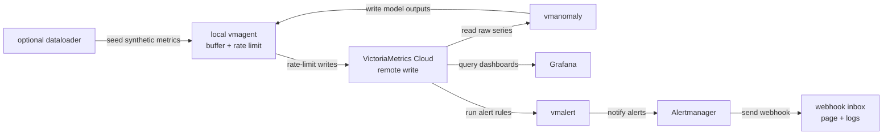

# Cloud anomaly detection stack

The Cloud stack does not start a local VictoriaMetrics database. vmanomaly and
vmalert read from VictoriaMetrics Cloud and write through local vmagent, which
buffers, rate-limits, relabels, and forwards samples to Cloud.

Cloud mode also starts Alertmanager and the local webhook inbox, so alert
notifications can be inspected without Slack, email, or external credentials.
> **Note:** Cloud host ports are offset from local mode, so both stacks can run side by
side on one machine.



## Secrets

Required:

```bash
anomaly-detection/.secret/license
anomaly-detection/.secret/BEARER_TOKEN_READ
anomaly-detection/.secret/BEARER_TOKEN_WRITE
anomaly-detection/.secret/datasource_url
anomaly-detection/.secret/read_tenant_id
anomaly-detection/.secret/write_tenant_id
```

For initial verification, set both `read_tenant_id` and `write_tenant_id` to
the same tenant, for example `0:101`. After this works end to end,
`read_tenant_id` can remain the shared tenant with pre-created raw synthetic APM
data, while `write_tenant_id` can move to a participant tenant where vmanomaly
writes anomaly scores and where Grafana reads dashboards.

`datasource_url` may be either the VictoriaMetrics Cloud base URL or a full
`/select/<tenant>/prometheus` URL. `env.sh` normalizes the base URL, derives
read/write query URLs, and builds the remote-write URL.

Optional:

```bash
anomaly-detection/.secret/grafana_datasource_url
anomaly-detection/.secret/remote_write_url
```

## Start

These commands assume a POSIX shell. Use Terminal on Linux/macOS or WSL 2 on
Windows.

Start without pushing synthetic data again:

```bash
cd anomaly-detection/cloud
./up.sh
```

Seed Cloud with the synthetic dataset first:

```bash
./up.sh --with-dataloader
```

For participant runs this is normally skipped because raw synthetic data is
expected to already exist in the shared read tenant. If organizers use
`--with-dataloader`, make sure the write token can write to the tenant selected
by `dataloader_tenant_id` or `read_tenant_id`.

Keep local Grafana/vmanomaly/vmagent volumes:

```bash
./up.sh --skip-dataloader --keep-volumes
```

## Follow

Open:

- Grafana: http://localhost:13000
- vmanomaly UI: http://localhost:18490
- vmagent: http://localhost:18429
- vmalert: http://localhost:18880
- Alertmanager: http://localhost:19093
- Alert webhook inbox: http://localhost:15001

Useful logs:

```bash
docker compose logs -f vmagent
docker compose logs -f vmanomaly
docker compose logs -f vmalert
docker compose logs -f grafana
docker compose logs -f alert-webhook
```

## Inspect In Grafana

After vmanomaly starts, use Grafana to inspect both model outputs and service
health:

- The anomaly score dashboard shows `anomaly_score`, `y`, `yhat`, and
  confidence bands for each configured query/model. In this workshop these
  output metric names use the `otel_apm_` prefix. Full guide:
  https://docs.victoriametrics.com/anomaly-detection/presets/#grafana-dashboard
- The self-monitoring dashboard shows vmanomaly runtime health, scheduler/model
  run timing, errors, and data flow metrics. Full guide:
  https://docs.victoriametrics.com/anomaly-detection/self-monitoring/

## Stop

Stop and remove local Cloud-stack volumes:

```bash
./down.sh
```

Stop but keep local volumes:

```bash
./down.sh --keep-volumes
```

No `down.sh` command deletes anything from VictoriaMetrics Cloud.
