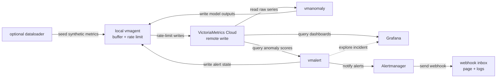

# Cloud anomaly detection stack

The Cloud stack does not start a local VictoriaMetrics database. vmanomaly and
vmalert read from VictoriaMetrics Cloud and write through local vmagent, which
buffers, rate-limits, relabels, and forwards samples to Cloud.

Cloud mode also starts Alertmanager and the local webhook inbox, so alert
notifications can be inspected without Slack, email, or external credentials.

> **Note:** Cloud host ports are offset from local mode, so both stacks can run
> side by side on one machine.



## Secrets

Required:

```bash
anomaly-detection/.secret/license
anomaly-detection/.secret/BEARER_TOKEN_READ
anomaly-detection/.secret/BEARER_TOKEN_WRITE
anomaly-detection/.secret/datasource_url
anomaly-detection/.secret/read_tenant_id
anomaly-detection/.secret/write_tenant_id
```

Set `read_tenant_id` to the shared tenant with pre-created raw synthetic APM
data. Set `write_tenant_id` to the participant tenant where vmanomaly writes
anomaly scores and where vmalert and Grafana read participant-specific outputs.
For example, `read_tenant_id=1000:0` and `write_tenant_id=12:0` means:

- vmanomaly reads raw APM input from `1000:0`
- vmagent uses the restricted write token to write model outputs to `12:0`
- vmalert reads anomaly scores from `12:0` and writes alert state through
  vmagent with the same restricted write token
- Grafana anomaly-score and self-monitoring dashboards read from `12:0`
- Grafana also provisions a shared raw-data datasource for `1000:0`
- the optional dataloader writes through vmagent to the tenant encoded by the
  active write token

The read token must be allowed to query the participant output tenant, because
vmalert and Grafana read anomaly scores and self-monitoring metrics from that
tenant.

`datasource_url` may be either the VictoriaMetrics Cloud base URL or a full
`/select/<tenant>/prometheus` URL. `env.sh` normalizes the base URL and derives
read/write query URLs. vmagent writes to the Cloud `/prometheus/api/v1/write`
endpoint; the restricted write token determines the destination tenant. If you
intentionally use a regular non-tenant-specific token, override
`remote_write_url` with the full `/insert/<tenant>/prometheus/api/v1/write`
path for that token.

> **Note:** Participant cloud mode writes to the tenant encoded by the active
> write token. If organizers need to seed a separate shared raw-data tenant with
> the dataloader, run a dedicated seeding pass with credentials for that shared
> tenant, or temporarily use the shared write token for that run.

Optional:

```bash
anomaly-detection/.secret/grafana_datasource_url
anomaly-detection/.secret/remote_write_url
```

## Start

These commands assume a POSIX shell. Use Terminal on Linux/macOS or WSL 2 on
Windows.

Start without pushing synthetic data again:

```bash
cd anomaly-detection/cloud
./up.sh
```

Seed Cloud with the synthetic dataset first:

```bash
./up.sh --with-dataloader
```

For participant runs this is normally skipped because raw synthetic data is
expected to already exist in the shared read tenant. If organizers use
`--with-dataloader`, make sure the write token can write to the tenant being
seeded.

Keep Cloud-stack Grafana/vmanomaly/vmagent Docker volumes:

```bash
./up.sh --skip-dataloader --keep-volumes
```

## Follow

Open:

- Grafana: http://localhost:13000
- vmanomaly UI: http://localhost:18490
- vmagent: http://localhost:18429
- vmalert: http://localhost:18880
- Alertmanager: http://localhost:19093
- Alert webhook inbox: http://localhost:15001

When an alert is pending or firing in vmalert, its **Source link** opens the
Grafana anomaly-score dashboard filtered to the alert's `for` query alias.

Useful logs:

```bash
docker compose logs -f vmagent
docker compose logs -f vmanomaly
docker compose logs -f vmalert
docker compose logs -f grafana
docker compose logs -f alert-webhook
```

## Inspect In Grafana

After vmanomaly starts, use Grafana to inspect both model outputs and service
health:

- The anomaly score dashboard shows `anomaly_score`, `y`, `yhat`, and
  confidence bands for each configured query/model. In this workshop these
  output metric names use the `otel_apm_` prefix. Full guide:
  https://docs.victoriametrics.com/anomaly-detection/presets/#grafana-dashboard
- The self-monitoring dashboard shows vmanomaly runtime health, scheduler/model
  run timing, errors, and data flow metrics. Full guide:
  https://docs.victoriametrics.com/anomaly-detection/self-monitoring/

## Stop

Stop and remove Cloud-stack Docker volumes:

```bash
./down.sh
```

Stop but keep local volumes:

```bash
./down.sh --keep-volumes
```

No `down.sh` command deletes anything from VictoriaMetrics Cloud.
