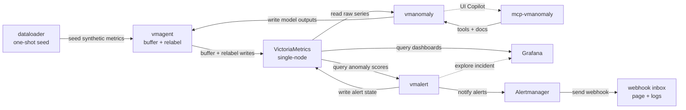

# Local anomaly detection stack

The local stack is self-contained. It starts VictoriaMetrics, vmagent,
vmanomaly, mcp-vmanomaly, Grafana, vmalert, Alertmanager, and an optional one-shot dataloader.
Alertmanager sends demo notifications to a local webhook inbox that shows
alerts on a tiny local web page and in Docker logs, so no Slack, email, or
external credentials are needed.



## Start

Put the vmanomaly license at:

```bash
anomaly-detection/.secret/license
```

Optional: put an Anthropic key in
`anomaly-detection/.secret/ANTHROPIC_API_KEY`. `up.sh` then enables the UI
Copilot with `anthropic:claude-sonnet-5`; MCP starts either way. See
[AI assistance](https://docs.victoriametrics.com/anomaly-detection/ui/#ai-assistance).

These commands assume a POSIX shell. Use Terminal on Linux/macOS or WSL 2 on
Windows.

Start from this directory:

```bash
cd anomaly-detection/local
./up.sh
```

By default, local startup resets Docker volumes and runs the dataloader once.
That gives a reproducible dataset for each demo run.

Reuse an already seeded dataset:

```bash
./up.sh --skip-dataloader --keep-volumes
```

Run the dataloader but keep existing volumes:

```bash
./up.sh --with-dataloader --keep-volumes
```

Reset volumes explicitly:

```bash
./up.sh --reset-volumes
```

## Follow

Open:

- Grafana: http://localhost:3000
- VictoriaMetrics: http://localhost:8428
- vmagent: http://localhost:8429
- vmanomaly UI: http://localhost:8490
- MCP endpoint: http://localhost:8081/mcp
- vmalert: http://localhost:8880
- Alertmanager: http://localhost:9093
- Alert webhook inbox: http://localhost:5001

When an alert is pending or firing in vmalert, its **Source link** opens the
Grafana anomaly-score dashboard filtered to the alert's `for` query alias.

Useful logs:

```bash
docker compose logs -f dataloader
docker compose logs -f vmanomaly
docker compose logs -f mcp-vmanomaly
docker compose logs -f vmagent
docker compose logs -f alert-webhook
```

## Explore In vmanomaly UI

Open the server queries in the UI and compare the configured online models:
Temporal Envelope learns smooth daily/weekly latency and traffic behavior,
while MAD remains the lightweight baseline for the simpler payment-error
ratio. With Copilot enabled, ask it to inspect the current query, explain the
model choice, or validate a proposed tuning change before applying it.

## Inspect In Grafana

After vmanomaly starts, use Grafana to inspect both model outputs and service
health:

- The anomaly score dashboard shows `anomaly_score`, `y`, `yhat`, and
  confidence bands for each configured query/model. In this workshop these
  output metric names use the `otel_apm_` prefix. Full guide:
  https://docs.victoriametrics.com/anomaly-detection/presets/#grafana-dashboard
- The self-monitoring dashboard shows vmanomaly runtime health, scheduler/model
  run timing, errors, and data flow metrics. Full guide:
  https://docs.victoriametrics.com/anomaly-detection/self-monitoring/

## Stop

Stop and remove generated data:

```bash
./down.sh
```

Stop but keep Docker volumes:

```bash
./down.sh --keep-volumes
```

## Notes

- The dataloader writes 6 weeks of history and 2 days into the future at a
  30-second raw sample interval.
- vmanomaly backtesting replays the recent window from `shared/env-common.sh`
  and defaults to the last 3 days.
- vmagent relabeling maps `backfill_online` to `online`, so dashboard series
  imitate continuous periodic scheduling.
